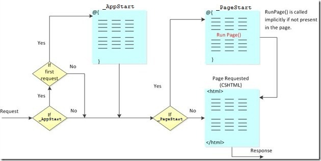

# ASP.NET Web Pages - 全局页面

本章介绍全局页面 AppStart 和 PageStart。

## 在 Web 启动之前：\_AppStart

大多数的服务器端代码是写在个人网页里边。例如，如果网页中包含输入表单，那么这个网页通常包含用来读取表单数据的服务器端代码。

然而，您可以通过在您的站点根目录下创建一个名为 \_AppStart 的页面，这样在站点启动之前可以先启动代码执行。如果存在此页面，ASP.NET 会在站点中其它页面被请求时，优先运行这个页面。

\_AppStart 的典型用途是启动代码和初始化全局数值（比如计数器和全局名称）。

**注释 1：**\_AppStart 的文件扩展名与您的网页一致，比如：\_AppStart.cshtml。

**注释 2：**\_AppStart 有下划线前缀。因此，这些文件不可以直接浏览。

## 在每一个页面之前：\_PageStart

就像 \_AppStart 在您的站点启动之前就运行一样，您可以编写在每个文件夹中的任何页面之前运行的代码。

对于您网站中的每个文件夹，您可以添加一个名为 \_PageStart 的文件。

\_PageStart 的典型用途是为一个文件夹中的所有页面设置布局页面，或者在运行某个页面之前检查用户是否已经登录。

## 它是如何工作的？

下图显示了它是如何工作的：

当接收到一个请求时，ASP.NET 会首先检查 \_AppStart 是否存在。 如果 \_AppStart 存在且这是站点接收到的第一个请求，则运行 \_AppStart。

然后 ASP.NET 检查 \_PageStart 是否存在。如果 \_PageStart 存在，则在其它被请求的页面运行之前先运行 \_PageStart。

您可以在 \_PageStart 中调用 RunPage() 来指定被请求页面的运行位置。否则，默认情况下，被请求页面是在 \_PageStart 运行之后才被运行。

