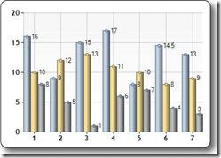
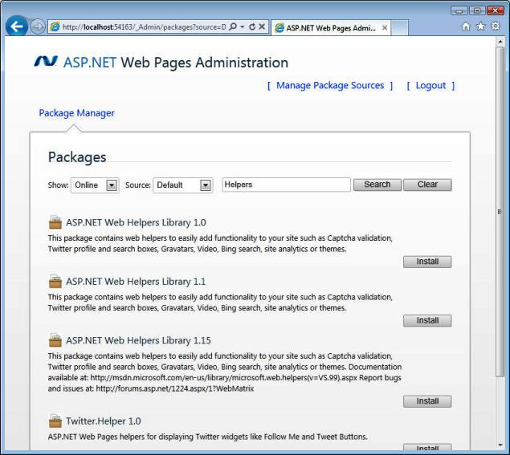

# ASP.NET Web Pages - 帮助器

Web 帮助器大大简化了 Web 开发和常见的编程任务。

## ASP.NET 帮助器

ASP.NET 帮助器是通过几行简单的 Razor 代码即可访问的组件。

您可以使用存放在 .cshtml 文件中的 Razor 语法构建自己的帮助器，或者使用内建的 ASP.NET 帮助器。

在本教程接下来的章节中，您将学到如何使用 Razor 帮助器。

下面是一些有用的 Razor 帮助器的简短说明：

## WebGrid 帮助器

WebGrid 帮助器简化了显示数据的方式：

*   自动创建一个 HTML 表格来显示数据
*   支持不同的格式化选项
*   支持数据分页显示（第一页、下一页、上一页、最后一页）
*   支持通过点击列表标题进行排序

## Chart 帮助器

"Chart 帮助器" 能显示不同类型的带有多种格式化选项和标签的图表图像。

Chart 帮助器显示的数据来源可以是数组、数据库或者文件。

## WebMail 帮助器

WebMail 帮助器提供了使用SMTP（Simple Mail Transfer Protocol 简单邮件传输协议）发送电子邮件的功能。

## WebImage 帮助器

WebImage 帮助器提供了管理网页中图像的功能。

关键词：翻转、旋转、缩放、水印。

## 第三方帮助器

通过 Razor，您可以利用内建的或者第三方的帮助器来简化电子邮件、数据库、多媒体、社交网络以及很多其他问题（如导航和的网络安全）的使用。

## 安装帮助器

WebMatrix 已经包含了一些帮助器，您还可以手动安装其他的帮助器。

在 [w3cschool.cc 的 WebPages 帮助器参考手册](webpages-ref-helpers.html)中，您可以看到一个便捷的参考手册，包含了内建帮助器和其他可以通过手动安装附加到 ASP.NET Web Helpers Library 工具包中的帮助器。

如果您在 WebMatrix 中创建了一个网站，请按照下面的步骤安装帮助器：

1.  在 WebMatrix 中，打开 **Site** 工作区。
2.  点击 **Web Pages Administration**。
3.  使用密码 * 登录到 Web Pages Administration。
4.  使用 **搜索区** 搜索帮助器。
5.  点击 **Install** 安装您所需的帮助器。

（* 如果您是第一次使用 Web Pages Administration，会提示您创建一个密码。）

