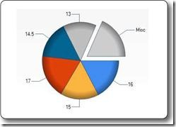

# ASP.NET Web Pages - Chart 帮助器

Chart 帮助器 - 众多有用的 ASP.NET Web 帮助器之一。

## Chart 帮助器

在前面的章节中，您已经学习了如何使用 ASP.NET 的 "帮助器"。

前面已经介绍了如何使用 "WebGrid 帮助器" 在网格中显示数据。

本章介绍如何使用 "Chart 帮助器" 以图形化的形式显示数据。

"Chart 帮助器" 可以创建不同类型的带有多种格式化选项和标签的图表图像。它可以创建面积图、条形图、柱形图、折线图、饼图等标准图表，也可以创建像股票图表这样的更专业的图表。



在图表中显示的数据可以是来自一个数组，一个数据库，或者一个文件中的数据。

## 根据数组创建图表

下面的实例显示了根据数组数据显示图表所需的代码：

## 实例

```
@{  
var myChart = new Chart(width: 600, height: 400)  
.AddTitle("Employees")  
.AddSeries(chartType: "column",  
xValue: new[] { "Peter", "Andrew", "Julie", "Mary", "Dave" },  
yValues: new[] { "2", "6", "4", "5", "3" })  
.Write();  
}
```

[运行实例 ?](/try/showfile_c.php?filename=try_webpages_cs_005)

- **new Chart** 创建一个新的图表对象并且设置它的宽度和高度

- **AddTitle** 方法指定了图表的标题

- **AddSeries** 方法向图表中增加数据

- **chartType** 参数定义图表的类型

- **xValue** 参数定义 x 轴的名称

- **yValues** 参数定义 y 轴的名称

- **Write()** 方法显示图表

## 根据数据库创建图表

您可以执行一个数据库查询，然后使用查询结果中的数据来创建一个图表：

## 实例

```
@{  
var db = Database.Open("SmallBakery");  
var dbdata = db.Query("SELECT Name, Price FROM Product");  
var myChart = new Chart(width: 600, height: 400)  
.AddTitle("Product Sales")  
.DataBindTable(dataSource: dbdata, xField: "Name")  
.Write();  
}
```

[运行实例 ?](/try/showfile_c.php?filename=try_webpages_cs_006)

- **var db = Database.Open** 打开数据库（将数据库对象赋值给变量 db）

- **var dbdata = db.Query** 执行数据库查询并保存结果在 dbdata 中

- **new Chart** 创建一个新的图表对象并且设置它的宽度和高度

- **AddTitle** 方法指定了图表的标题

- **DataBindTable** 方法将数据源绑定到图表

- **Write()** 方法显示图表

除了使用 DataBindTable 方法之外，另一种方法是使用 AddSeries（见前面的实例）。DataBindTable 更容易使用，但是 AddSeries 更加灵活，因为您可以更明确地指定图表和数据：

## 实例

```
@{  
var db = Database.Open("SmallBakery");  
var dbdata = db.Query("SELECT Name, Price FROM Product");  
var myChart = new Chart(width: 600, height: 400)  
.AddTitle("Product Sales")  
.AddSeries(chartType:"Pie",  
xValue: dbdata, xField: "Name",  
yValues: dbdata, yFields: "Price")  
.Write();  
}
```

[运行实例 ?](/try/showfile_c.php?filename=try_webpages_cs_007)  

## 根据 XML 数据创建图表

<font size="3">

第三种创建图表的方法是使用 XML 文件作为图表的数据：

</font>

## 实例

```
@using System.Data;  

@{  
var dataSet = new DataSet();  
dataSet.ReadXmlSchema(Server.MapPath("data.xsd"));  
dataSet.ReadXml(Server.MapPath("data.xml"));  
var dataView = new DataView(dataSet.Tables[0]);  
var myChart = new Chart(width: 600, height: 400)  
.AddTitle("Sales Per Employee")  
.AddSeries("Default", chartType: "Pie",  
xValue: dataView, xField: "Name",  
yValues: dataView, yFields: "Sales")  
.Write();}  
}
```

[运行实例 ?](/try/showfile_c.php?filename=try_webpages_cs_008)

