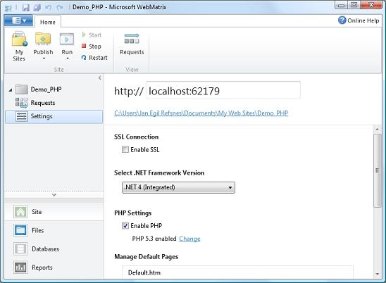

# ASP.NET Web Pages - PHP

PHP 开发人员请注意，Web Pages 可以用 PHP 编写。

## WebMatrix 支持 PHP

乍一看，认为 WebMatrix 只支持微软的技术。这是不正确的。在 WebMatrix 中，您能编写完整的 PHP 应用程序。

## 创建一个 PHP 站点

在[ASP.NET Web Pages - 创建一个网站](#)章节中，您已经创建了一个名为 "Demo" 的空网站，带有一个类型为 "CSHTML" 的空页面。

重复一遍创建的过程，创建一个名为 "Demo_PHP" 的空站点，勾选 "Enable PHP"（如下图所示），创建一个 PHP 类型的空白页，并将它命名 "index.php"，这样您就创建好了您的第一个 PHP 站点。



## 创建一个 PHP 页面

将下面的代码复制到 "index.php" 文件中：

## index.php

```
<!DOCTYPE html>  
<html>  
<body>  

<?php  
phpinfo();  
?>  

</body>  
</html>
```

运行文件，看看 PHP 页面的演示。

