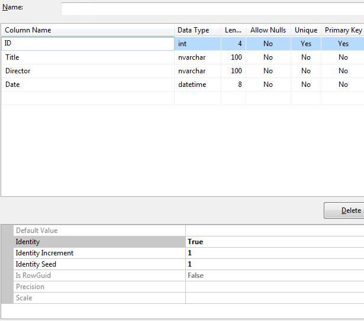

# ASP.NET MVC - SQL 数据库

为了学习 ASP.NET MVC，我们将构建一个 Internet 应用程序。

第 6 部分：添加数据库。

## 创建数据库

Visual Web Developer 带有名为 SQL Server Compact 免费的 SQL 数据库。

本教程所需的这个数据库可以通过以下几个简单的步骤来创建：

*   右击 **Solution Explorer** 窗口中的 **App_Data** 文件夹
*   选择 **Add, New Item**
*   选择 **SQL Server Compact Local Database ***
*   将数据库命名为 **Movies.sdf**
*   点击 **Add** 按钮

***** 如果选项中没有 SQL Server Compact Local Database，则说明您尚未在计算机上安装 SQL Server Compac。请通过以下链接进行安装：[SQL Server Compact](//www.microsoft.com/web/gallery/install.aspx?appid=SQLCE;SQLCEVSTools_4_0)

Visual Web Developer 会自动在 App_Data 文件夹中创建该数据库。

**注释：**在本教程中，需要您掌握一些关于 SQL 数据库的基础知识。如果您想先学习这个主题，请访问我们的 [SQL 教程](#)。

## 添加数据库表

双击 **App_Data** 文件夹中的 **Movies.sdf** 文件，将打开 **Database Explorer** 窗口。

如需在数据库中创建一个新的表，请右击 **Tables** 文件夹，然后选择 **Create Table**。

创建如下的列：

| 列 | 类型 | 是否允许为 Null |
| --- | --- | --- |
| ID | int (primary key) | No |
| Title | nvarchar(100) | No |
| Director | nvarchar(100) | No |
| Date | datetime | No |

对列的解释：

**ID** 是用于标识表中每条记录的整数（全数字）。

**Title** 是 100 个字符长度的文本列，用于存储影片的名称。

**Director** 是 100 个字符长度的文本列，用于存储导演的名字。

**Date** 是日期列，用于存储影片的发布日期。

在创建好上述列之后，您必须将 ID 列设置为表的主键（记录标识符）。要做到这点，请点击列名（ID），并选择 **Primary Key**。在 **Column Properties** 窗口中，设置 **Identity** 属性为 **True**：

当您创建好表列后，保存表并命名为 **MovieDBs**。

**注释：**

我们特意把表命名为 "MovieDBs"（以 s 结尾）。在下一章中，您将看到用于数据模型的 "MovieDB"。这看起来有点奇怪，不过这种命名惯例能确保控制器连接上数据库表，您必须这么使用。

## 添加数据库记录

您可以使用 Visual Web Developer 向 movie 数据库中添加一些测试记录。

双击 **App_Data** 文件夹中的 **Movies.sdf** 文件。

右击 Database Explorer 窗口中的 **MovieDBs** 表，并选择 **Show Table Data**。

添加一些记录：

| ID | Title | Director | Date |
| --- | --- | --- | --- |
| 1 | Psycho | Alfred Hitchcock | 01.01.1960 |
| 2 | La Dolce Vita | Federico Fellini | 01.01.1960 |

**注释：**ID 列会自动更新，您可以不用编辑它。

## 添加连接字符串

向您的 **Web.config** 文件中的 **&lt;connectionStrings&gt;** 元素添加如下元素：

<add name="MovieDBContext"  
connectionString="Data Source=|DataDirectory|Movies.sdf"  
providerName="System.Data.SqlServerCe.4.0"/>  

