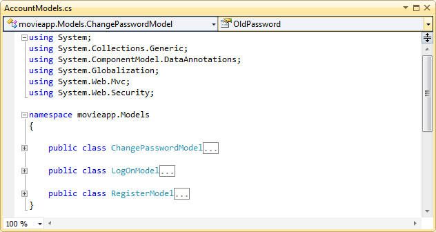

# ASP.NET MVC - 安全

为了学习 ASP.NET MVC，我们将构建一个 Internet 应用程序。

第 8 部分：添加安全。

## MVC 应用程序安全

**Models 文件夹**包含表示应用程序模型的类。

Visual Web Developer 自动创建 **AccountModels.cs** 文件，该文件包含用于应用程序认证的模型。

**AccountModels** 包含 **LogOnModel**、**ChangePasswordModel** 和 **RegisterModel**：



## Change Password 模型

```
public class ChangePasswordModel  
{  

[Required]  
[DataType(DataType.Password)]  
[Display(Name = "Current password")]  
public string OldPassword { get; set; }  

[Required]  
[StringLength(100, ErrorMessage = "The {0} must be at least {2} characters long.", MinimumLength = 6)]  
[DataType(DataType.Password)]  
[Display(Name = "New password")]  
public string NewPassword { get; set; }  

[DataType(DataType.Password)]  
[Display(Name = "Confirm new password")]  
[Compare("NewPassword", ErrorMessage = "The new password and confirmation password do not match.")]  
public string ConfirmPassword { get; set; }  

}  
```

## Logon 模型

```
public class LogOnModel  
{  

[Required]  
[Display(Name = "User name")]  
public string UserName { get; set; }  

[Required]  
[DataType(DataType.Password)]  
[Display(Name = "Password")]  
public string Password { get; set; }  

[Display(Name = "Remember me?")]  
public bool RememberMe { get; set; }  

}  
```

## Register 模型

```
public class RegisterModel  
{  

[Required]  
[Display(Name = "User name")]  
public string UserName { get; set; }  

[Required]  
[DataType(DataType.EmailAddress)]  
[Display(Name = "Email address")]  
public string Email { get; set; }  

[Required]  
[StringLength(100, ErrorMessage = "The {0} must be at least {2} characters long.", MinimumLength = 6)]  
[DataType(DataType.Password)]  
[Display(Name = "Password")]  
public string Password { get; set; }  

[DataType(DataType.Password)]  
[Display(Name = "Confirm password")]  
[Compare("Password", ErrorMessage = "The password and confirmation password do not match.")]  
public string ConfirmPassword { get; set; }  

}  
```

