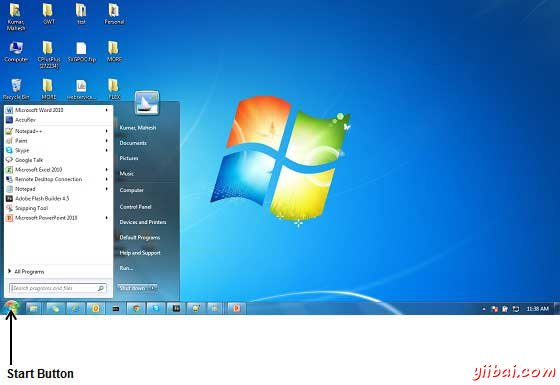
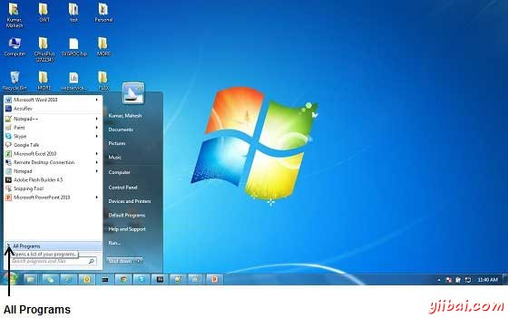
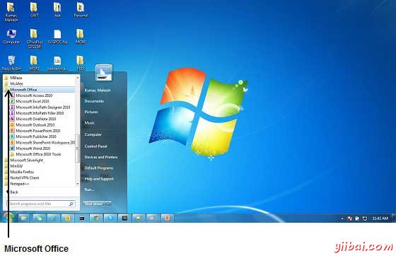
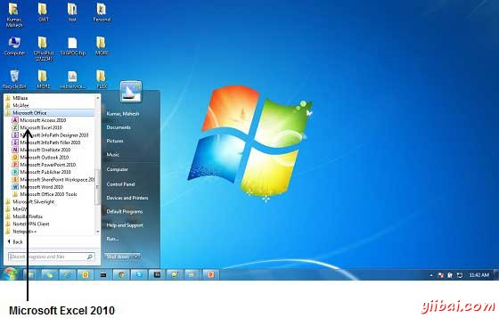
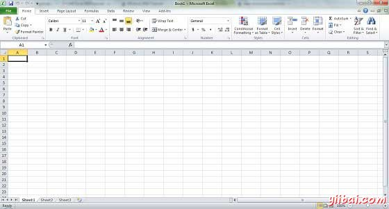

# Excel教程

Excel是微软办公套装软件(Microsoft office的组件之一)的一个重要的组成部分，它可以进行各种数据的处理、统计分析和辅助决策操作，广泛地应用于管理、统计财经、金融等众多领域。

Microsoft Excel是微软Microsoft编写并分发Windows和Mac OS X商用电子表格应用程序，在写这篇教程的时候的当前版本是微软Windows Excel2010和Mac OS X Excel 2011。

Microsoft Excel是一个电子表格工具，能够进行计算，分析数据和整合来自不同程序的信息。默认情况下，保存在Excel2010文档保存为扩展名为.xlsx，Excel之前版本的文件扩展名是.xls。

本章将教你如何在简单的步骤，启动Excel 2010应用程序。 假设您已经将Microsoft Office2010安装在你的电脑上，要启动Excel应用程序，请在您的电脑以下步骤：

**步骤** (1): 点击 **开始 **按钮。

**步骤 (2):** 从菜单中单击 **所有程序** 选项。

**步骤 (3):** 从子菜单搜索**_Microsoft Office_**，然后单击它。

**步骤 (4):**  从子菜单中搜索**_Microsoft Excel2010_**，点击它。

这将启动 **Microsoft Excel 2010** 应用程序，会看到下面的Excel窗口。

