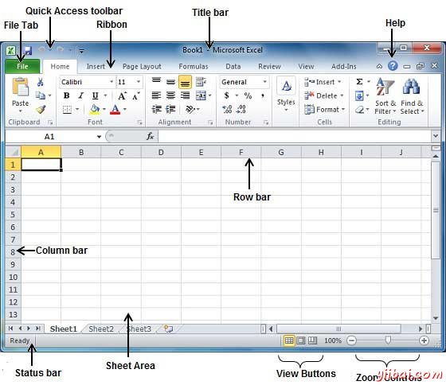
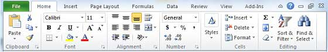

# Excel浏览窗口 - Excel教程

当启动Excel应用程序，会显示基本的窗口(界面)。让我们了解这个窗口的各个重要组成部分。

## 文件选项卡：

该文件选项卡取代Excel 2007中的"办公"按钮，您可以点击它来查看Backstage视图， 这是当你需要打开或保存文件，创建新表，打印纸，并做其他文件相关操作的地方。

## 快速访问工具栏：

这里你会发现正上方的File选项卡，其目的是提供一个方便的地方以Excel最常用的命令。您可以自定义这个工具栏根据您的要求。

## 功能区：

功能区包含以下三个组成部分的命令：

*   选项卡 : 它们显示在整个功能区的顶部，并包含相关命令的群体。主页，插入，页面布局的例子在功能区选项卡中。

*   分组: 他们组织相关的命令;每个组的名字出现在组下方的功能区。对于有关字体或一组命令相关对准指令等例子组

*   命令: 命令显示每个分组内如上所述。

## 标题栏：

这个位于中间和顶部或窗口。标题栏显示程序和表的标题。

## 帮助：

帮助图标可以被用来随时获取相关excel 有关帮助。这提供了Excel相关的各学科不错的教程。

## 缩放控制：

缩放控制可让您放大仔细看看文字。缩放控制包含向左或向右滑动来放大或缩小一个滑块，- 和+按钮，可以点击用来增加或减少缩放系数。

## 视图按钮：

本组有三个按钮位于缩放控制的左侧，在屏幕的底部附近，可以让Excel在各种表视图之间切换。

*   普通版式视图 : 这在普通视图中显示页。

*   页面布局视图 :这将显示页面在打印时出现完全一样。这给出了一个全屏幕的外观的文档。

*   分页符视图 : 这显示在打印时，其中的页面将换页预览。

## Sheet区域：

输入数据的区域。闪烁的竖条称为插入点，它代表在那里将文本键入时显示的位置。

## 行栏

行编号从1开始，并在不断输入数据时增加。最多可输入1,048,576行。

## 列栏

列编号从A开始并保持对输入数据增加。在Z之后，将开始一系列的AA，AB等。最高大小为16,384列。

## 状态栏：

这将显示表的信息以及所述插入点位置。从左至右，此栏可以包含的文档中的页面和词语，语言等的总数

通过右键单击状态栏，可以在任何地方通过选择或不选择从提供的列表选项来配置。

## 对话框启动器：

这是在多组功能区的右下角非常小箭头。单击此按钮会打开一个对话框或任务窗格中，提供有关组更多的选择。

