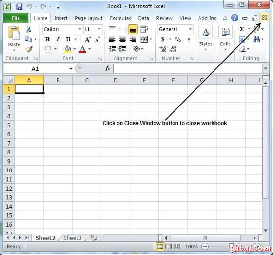

# Excel关闭工作簿 - Excel教程

## 关闭工作簿

下面是关闭工作簿的步骤

**步骤(1)**单击关闭按钮，如下图所示。

你会看到一个保存工作簿的确认消息。

**步骤(2)**按Save按钮保存工作簿就像我们在[MS Excel做 - 保存工作簿](http://www.yiibai.com/excel/excel_save_workbook.html)的这一章节。

现在工作将得到保存。

