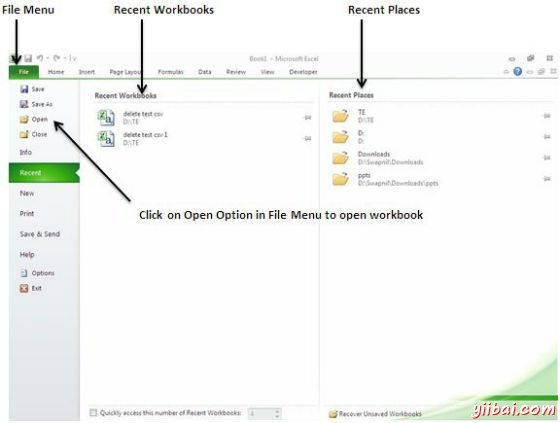
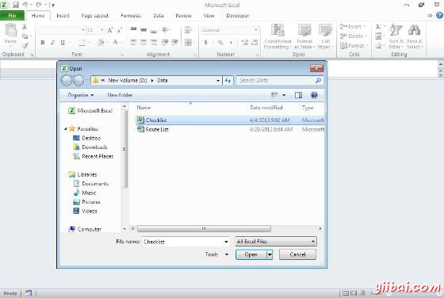
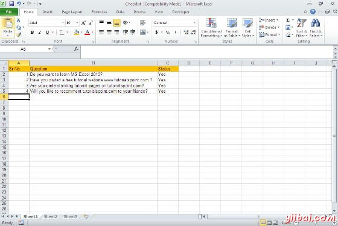

# Excel打开工作簿 - Excel教程

打开工作簿

让我们来看看如何打开Excel工作簿

**步骤(1)**单击文件菜单，如下图所示。可以看到在文件菜单打开选项。 有两列在最近的工作簿最近的地方，你可以看到最近打开的工作簿，并从那里工作簿打开最近的地方。

**步骤(2)**点击打开选项，如下图所示将打开浏览对话框。浏览目录，找到你需要打开文件。

**步骤(3)**当你选择了工作簿就会被打开，如下面的工作簿：

