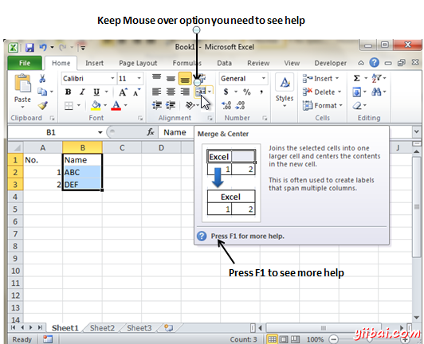
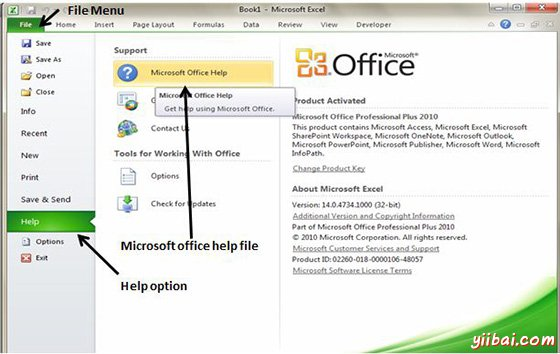

# Excel上下文帮助 - Excel教程

MS Excel中鼠标经过提供上下文相关的帮助。查看上下文特定菜单选项的帮助可将鼠标悬停在一段时间的选项。然后就可以看到上下文敏感的帮助，如下图所示

## 获得更多帮助

对于使用MS Excel可从微软获得更多的帮助，您可以按F1键或通过 File -&gt; Help -&gt; Support -&gt; Microsoft office Help

