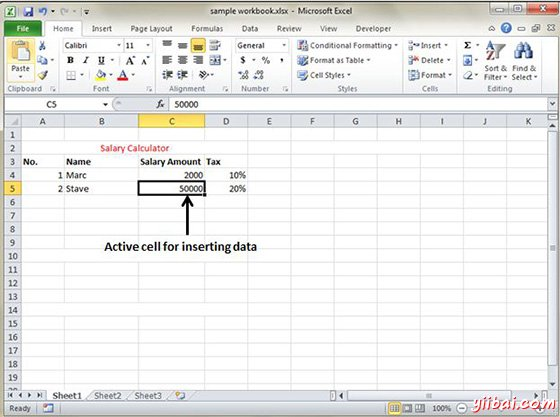
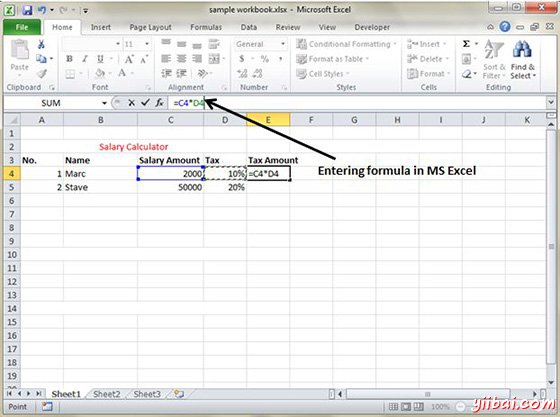
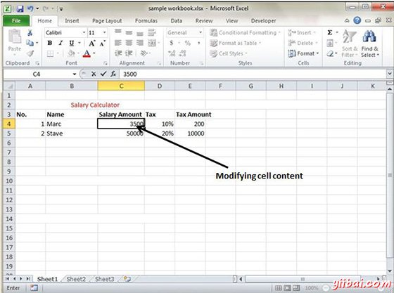

# Excel插入数据 - Excel教程

在MS Excel总共有1048576*16384单元格.MS Excel单元格可以有文字，数值或公式。 MS Excel单元格中最多可以放32000个字符。

## 插入数据

对于插入在MS Excel中的数据只是激活单元格类型的文字或数字，然后按回车键或导航键。

## 插入公式

对于在MS Excel中插入公式去公式栏，输入公式，然后按回车键或导航键。请参阅下面的屏幕截图来了解它。

## 修改单元格内容

修改单元格内容只是激活单元格，输入一个新值，然后按回车键或导航键看到变化。请参阅下面的屏幕截图来了解它。

