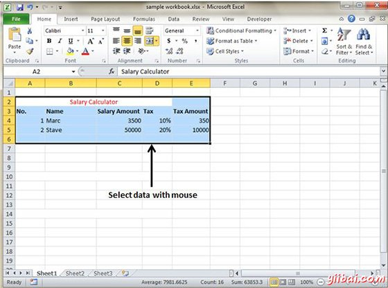
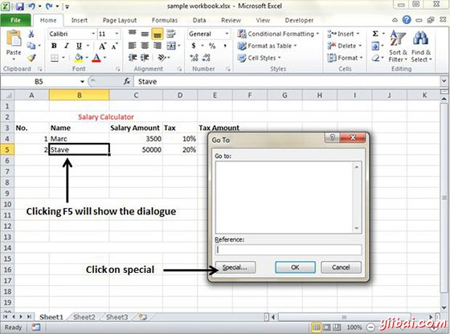
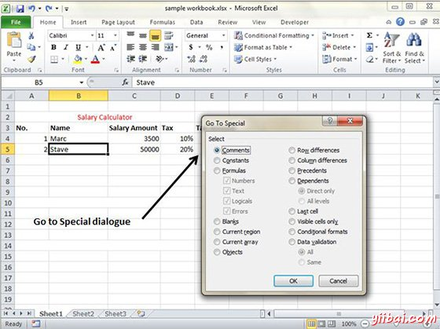
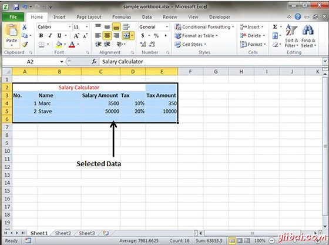

# Excel选择数据 - Excel教程

MS Excel中提供了在工作表中选择数据的多方法。让我们来看看这些方法。

## 使用鼠标选择

将鼠标拖动到要选择的数据。它将选择这些单元格如下所示。

## 使用特殊选择

如果您想选择特定区域，选择该区域的单元格。按F5将显示如下的对话。

单击特殊按钮，看看下面的对话。从单选按钮选择当前区域。 点击OK，看当前区域选择。

可以看到在下面屏幕上的数据被选为当前区域。

