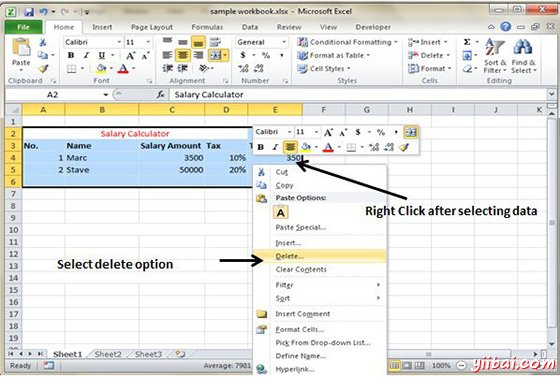
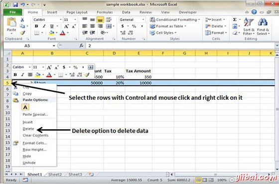

# Excel删除数据 - Excel教程

MS Excel提供了删除的表数据的各种方法。让我们来看看这些方法。

## 使用鼠标删除

选择要删除的数据。右键单击工作表上。选择删除选项，它会删除数据。

## 使用Delete键删除

选择要删除的数据。按键盘的Delete按钮，它会删除数据。

## 选择删除的行

选择您想要的鼠标点击+控制键来删除行。然后右键单击它会显示各种选项。选择删除选项删除选定的行。

