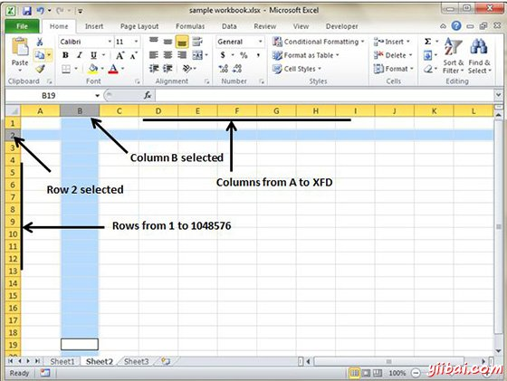

# Excel行和列 - Excel教程

## 行和列的基础知识

MS Excel在表格格式是由行和列组成。

*   行为水平方向，列为垂直方向。

*   每一行确定了垂直地在工作表的左侧行号。

*   每列由在水平方向页的顶端的列标题确定

对于MS Excel 2010的行号范围从1到104857共1048576行，列的范围从A到XFD共16384列

## 导航行和列

让我们来看看如何移动到最后一行或最后一列。

*   您可以通过点击Ctrl +向下箭头导航到最后一行。

*   您可以通过点击控制+右箭头导航到最后一列。

## 单元格简介

行和列的交叉点被称为单元格。

单元格是确定与列标题和行号的组合。

例如：A1, A2

