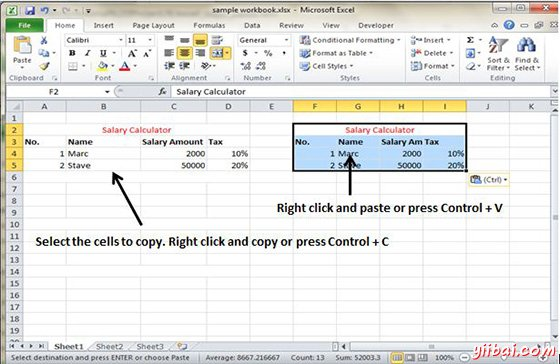
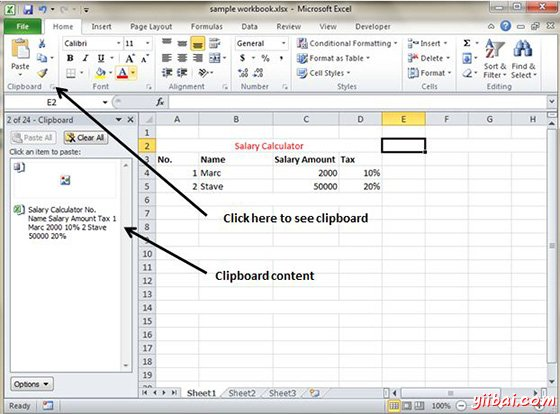
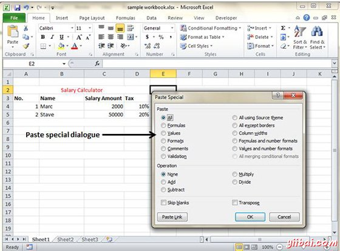

# Excel复制和粘贴 - Excel教程

MS Excel提供以不同的方式复制粘贴选项。复制粘贴的最简单的方法如下。

## 复制粘贴

*   要做到复制粘贴只需选择要复制的单元格。选择后点击鼠标右键或者按下Control+ C.复制选项

*   选择单元格，需要粘贴复制的内容。右键单击并选择粘贴选项或按Control + V.

在这种情况下，MS Excel将复制的一切数值，公式，格式，注释和验证。MS Excel将覆盖有粘贴的内容。如果你想撤消请按Control + Z

## 复制粘贴使用Office剪贴板

当你在MS Excel的数据复制它并放入Windows和Office剪贴板内容。您可以通过查看剪贴板中的内容 Home -&gt; Clipboard.查看剪贴板中的内容。选择单元格并粘贴。单击粘贴，粘贴内容。

## 以特殊的方式复制粘贴

你可能不希望复制一切，在某些情况下只复制值，例如或要复制到单元格格式化。选择粘贴特殊选项，如下图所示。

下面是以选择性粘贴的一些选择。

*   **全部:** 从Windows剪贴板粘贴单元格的内容，格式和数据验证。

*   **公式 : **粘贴公式，而不是格式化。

*   **值: **只粘贴数值而不是公式。

*   **格式: **粘贴源范围仅格式。

*   **注释: **粘贴相应单元注释。

*   **验证:** 在单元格提供验证。

*   **所有使用源主题 :** 粘贴公式和所有格式。

*   **所有的边框除外 : **粘贴一切，除了出现在源范围的边界。

*   **列宽: **粘贴公式并复制复制的单元格的列宽。

*   **公式和数字格式 :** 只粘贴公式和数字格式。

*   **值和数字格式: **粘贴公式的结果，加上数值

*   **合并条件格式 :** 当复制的单元格包含条件格式此图标才会显示。当点击它融合了在目标范围内的任何条件格式复制的条件格式。

*   **移调: **改变的范围内复制的方向。行成为列和列将成为行。任何公式复制的范围内进行调整，以使它们正常工作时换位。

