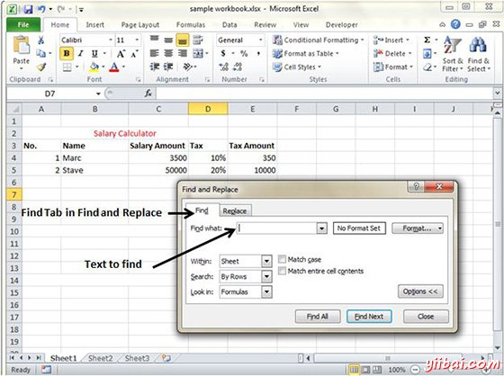

# Excel查找和替换 - Excel教程

MS Excel提供了查找和替换在工作表中选项。

## 查找和替换对话

让我们来看看如何访问查找和替换对话。

要访问查找和替换，选择 Home -&gt; Find & Select -&gt; Find 或按 Control + F Key如下文看到图片。

你可以看到查找和替换如下对话。

您可以替换为新的文本替换选项卡中找到的文本

## 浏览选项

现在，让我们来看看在查找对话框提供的各种选项。

*   **内部**：指定搜索应该是在工作表或工作簿。

*   **按搜索**：按行或列指定的内部搜索方法。

*   **内查找**：如果你想找到公式文本以及再选择此选项。

*   **区分大小写**：如果你想匹配类似小写字母或单词的大写的话，那么使用选项

*   **匹配整个单元格的内容**：如果你想精确随着单元格的词匹配，则选中此选项。

