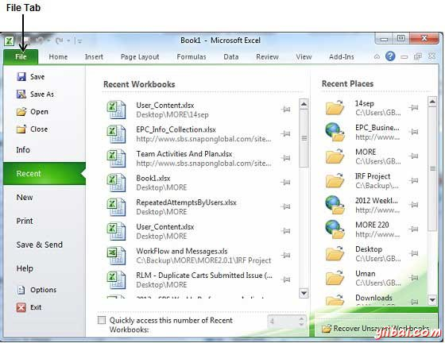
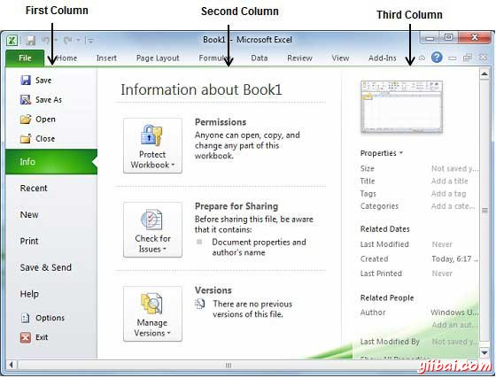

# Excel BackStage视图 - Excel教程

Backstage视图已在Excel 2010中被引入，并作为管理表的中心位置。Backstage视图有助于创建新的工作表，保存和打开表，打印和共享表等等。

进入Backstage视图非常简单：只需点击文件选项卡，位于Excel功能区的左上角。如果还没有打开任何表，那么将看到一个窗口，其中列出了所有最近打开的表如下：

如果已经有一个打开的表，那么它会显示一个窗口，显示打开表的细节，如下图所示。Backstage视图显示了三列，大部分会选择在第一列的可用选项。

Backstage视图的第一列将有以下选择：

| 选项 | 描述 |
| --- | --- |
| Save | 如果一个现有工作表被打开，它会被保存，否则它会显示一个对话框，询问工作表名称 |
| Save As | 一个对话框将显示询问表名和表类型，默认情况下，它会保存为工作表的2010格式的扩展 .xlsx |
| Open | 此选项将用于打开现有的Excel工作表 |
| Close | 这个选项将被用来关闭一个打开的工作表 |
| Info | 此选项将显示已打开的表的信息 |
| Recent | 这个选项会列出所有的最近打开表 |
| New | 此选项将被用来打开一个新的工作表 |
| Print | 这个选项将被用于打印的打开工作表 |
| Save & Send | 此选项将保存打开的表，将显示选项，使用电子邮件等方式发送工作表 |
| Help | 您可以使用此选项来获得所需有关Excel2010的帮助 |
| Options | 使用此选项可以设置有关Excel 2010各种选项 |
| Exit | 使用此选项可以关闭该表并退出 |

## 工作表信息

在第一列可单击信息选项，它显示在Backstage视图的第二列的信息如下：

*   **兼容模式: **如果该表不是一个原始Excel2007/2010板，转换按钮会出现在这里，使您能够轻松地更新它的格式。否则，这个类别不会出现。

*   **权限:** 可以使用此选项来保护您的Excel工作表。可以设置一个密码，这样没有人可以打开你的工作表，或者也可以锁定工作表，这样没有人可以编辑您的工作表。

*   **准备共享: **本节主要介绍你应该知道工作表的重要信息，然后将其发送给其他人，比如开发的工作表中编辑的记录。

*   **版本:** 如果工作表已保存了几次，你能够从这里访问其以前的版本。

## 工作表属性

可在第一列单击信息选项，在Backstage视图第三列显示各种属性。这些属性包括纸张尺寸，标题，标签，分类等。

您也可以编辑各种属性。只是尝试单击属性值，如果属性是可编辑的，然后它会显示一个文本框，可以将您喜欢的文字标题，标签，注释，作者。

## 退出Backstage视图

要从Backstage视图中退出，只点击文件选项卡或在键盘上按Esc键，返回到Excel工作模式。

