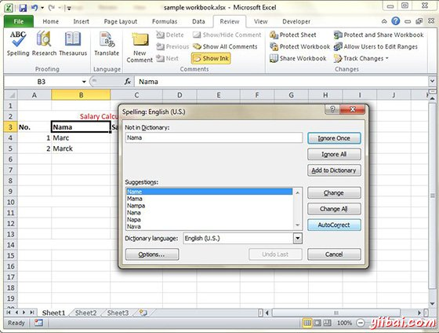

# Excel拼写检查 - Excel教程

MS Excel提供的文字处理程序拼写检查功能。我们使用拼写检查功能的帮助可以摆脱拼写错误。

## 拼写检查的基础

让我们来看看如何访问拼写检查。

*   要访问拼写检查器，选择 Review ➪ Spelling 或者按 F7.

*   要检查特定范围的拼写，只需选择范围您在激活拼写检查之前。

*   如果拼写检查发现的任何字它不承认正确的，它会显示有建议选择拼写对话。

## 浏览选项

让我们来看看以拼写检查对话提供各种选项。

*   **忽略一次：**忽略词并继续拼写检查。

*   **全部忽略：**忽略这个词和它的所有后续出现。

*   **加入词典：**单词添加到字典中。

*   **更改：**字更改为在建议列表中选择词。

*   **全部更改：**字更改为在建议列表中选择的单词，改变了这一切后续出现不再询问。

*   **更正：**拼错的单词和正确的拼写(你从列表中选择)添加到自动更正列表。

