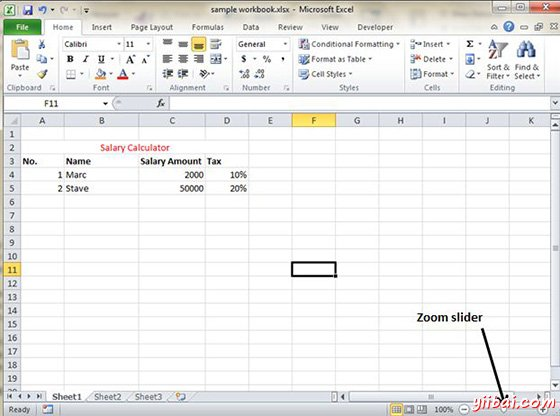
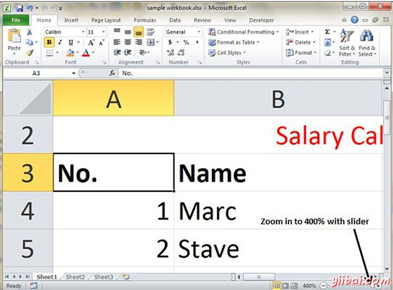
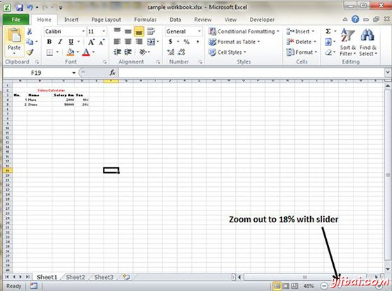

# Excel放大/缩小 - Excel教程

## 缩放滑块

在MS Excel 屏幕上默认显示为100%。可以改变从10%(微小)，缩放比例为400%(巨大)。缩放不会改变的字体大小，因此它打印输出没有影响。

您可以在如下工作簿的右下角查看缩放滑块。

## 放大

您可以通过移动滑块向右放大工作簿。它将改变工作簿的只读视图。可以以最大400%缩放。请参阅下面的屏幕截图。

## 缩小

您可以通过移动滑块向左缩小工作簿。它将改变工作簿的只读视图。最大以10%缩放。参见下面的屏幕截图。

