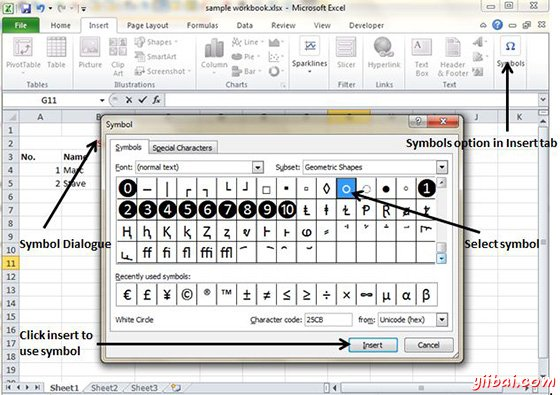
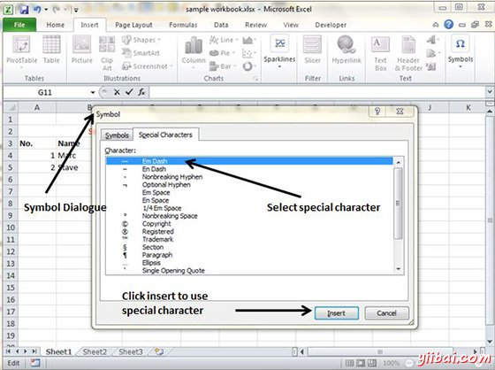

# Excel特殊符号 - Excel教程

在某些情况下如果你想插入一些符号或特殊字符未在键盘上找到，使用的符号选项。

## 使用符号

转到 插入»符号»特殊字符 查看可用的符号。你可以看到许多可用的符号有像 Pi，α，β等

选择要添加，然后单击插入使用该符号

## 使用特殊字符

转到插入»符号»特殊字符，查看可用的特殊字符。你可以看到许多特殊字符，可有类似版权，注册等

选择要添加，然后单击插入使用特殊字符的特殊字符

