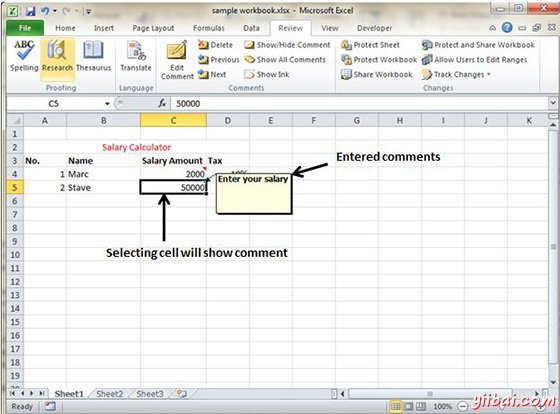
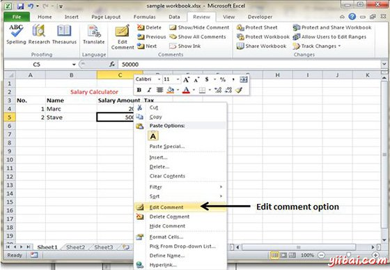
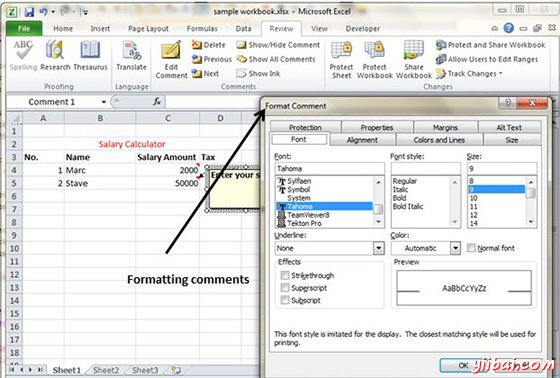

# Excel插入注释 - Excel教程

## 添加批注到单元格

加入到单元格注释有助于理解单元格的目的，它应该有什么输入，等等。它有助于理解文档

若要添加注释单元格选择单元格，执行下面的动作

*   选择审查 » 注释 » 新注释

*   右键单击该单元格，然后从可用选项插入注释。

*   按 Shift+F2

最初发表注释包括计算机的用户名。你可对文本的单元格批注进行修改

## 修改注释

您可以修改您之前进入注释如下。

*   选择要在其注释出现的单元格。

*   右键单击该单元格，然后从可用选项编辑注释。

*   修改注释

## 格式化注释

有几种格式化注释。对于格式化注释右键单击单元格»编辑注释»选择注释»右击它»格式发布注释，你可以改变颜色，字体，大小等方面来格式化注释。

