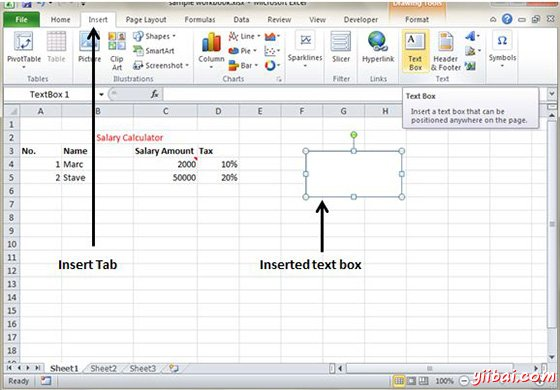
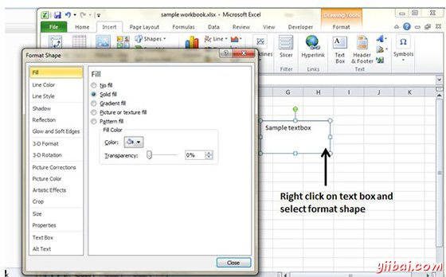

# Excel添加文本框 - Excel教程

## 文本框

文本框是结合文字有矩形图形对象的特殊图形对象。文本框和单元格注释是，他们显示相似矩形框中的文本，但文本框始终可见，而单元格批注成为选择后单元格可见。

## 添加文本框

要添加操作文本框，如下执行。

*   选择插入»文本框»选择文本框或绘制

最初发表注释包括计算机的用户名。你可对文本的单元格批注进行修改

## 格式文本框

当你添加了文本框，您可以通过更改字体，字体大小，字体样式和对齐方式等格式化文本框。让我们来看看一些重要的选项那里。

*   **填充：**指定填充的文本框一样，没有填充，实心填充。同时指定的文本框填充透明度。

*   **行颜色：**指定线颜色的线和透明度。

*   **行样式：**指定行样式和宽度。

*   **大小：**指定文本框的大小。

*   **属性：**指定文本框的一些属性。

*   **文本框：**指定文本框的布局，自动调整选项和内部空间。

