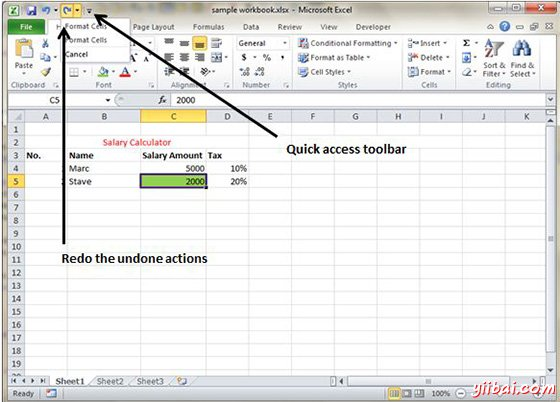

# Excel撤消更改 - Excel教程

## 撤消更改

您可以在Excel中通过使用撤消命令，几乎可撤消每一个动作。我们可以使用2种方式撤消更改。

*   从快速访问工具栏»点击撤消

*   请按Ctrl+ Z

可以反向通过执行撤消不止一次执行在过去的100动作的效果。如果你点击右侧的撤销按钮的箭头，你可以扭转操作的列表。单击某个项目在该列表撤消行动，所有你执行的后续操作。

## 重做更改

可以再次转回并撤消在Excel中执行的操作，使用重做命令。我们可以重做改变2种方式。

*   从快速访问工具栏»点击重做

*   请按Ctrl+ Y

