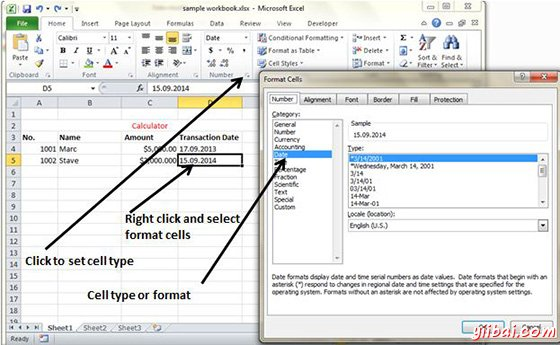

# Excel设置单元格类型 - Excel教程

## 格式化单元格

MS Excel单元格可以容纳不同类型，如数字，货币，日期等数据..您可以以各种方式设置下面的单元格类型：

*   右键单击单元格»设置单元格格式»数值

*   点击色带上的色带

## 各种单元格的格式

以下是各种单元格的格式。

*   **通用：**这是单元格的默认单元格的格式。

*   **数值：**这将显示单元格与分隔数

*   **货币：**该单元格显示货币即带有货币符号。

*   **会计：**类似于货币用于会计目的。

*   **日期：**多种日期格式，这个类似17-09-2013，17th-Sep-2013等

*   **时间：**不同的时间格式，如1.30PM，13.30等

*   **百分比：**这显示单元格以及小数，如50.00%的百分比

*   **分数：**显示单元格作为部分，如1/4，1/2等等

*   **科学计数：**显示单元格作为指数如 5.6E+01

*   **文本：**此单元格显示为正常文本。

*   **特别声明：**这是一个特殊的格式，单元格像邮编，电话号码

*   **自定义：**可以通过使用自定义格式。

