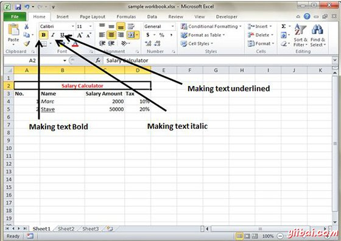
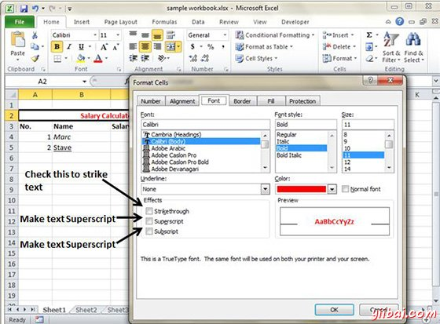

# Excel文字装饰 - Excel教程

可以更改单元格的文本装饰来改变它的外观和感觉。

## 文字修饰

在如下主页功能区的选项卡中提供的各种选项

*   Bold : 它使文本由选择首页»字体组»点击B或请按Ctrl+ B凸显

*   Italic : 它使文本倾斜通过选择首页»字体组»点击I 或请按Ctrl+ B

*   Underline : 它使文本通过选择首页»字体组»点击U或请按Ctrl+ B下划线

*   Double Underline : 它使文本强调选择首页»字体组»点击箭头附近U»选择双下划线

## 更多的文字装饰选项

可在下面的文字装饰更多选择 格式化单元»字体标签»影响单元格

*   删除线：这使得删除线在文本中心垂直

*   超级脚本：它使内容显示为超

*   子脚本：它使内容显示为子

