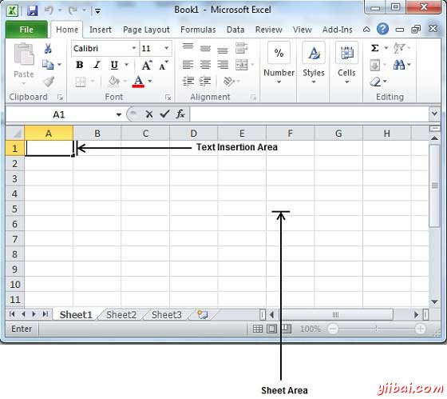
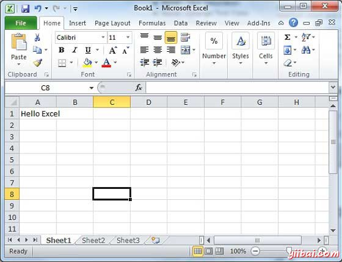

# Excel中输入值 - Excel教程

让我们看看在Excel工作表中输入文本是多么容易。希望你了解，当启动一个工作表，它会显示一个新的工作表，在默认情况下，如下图所示：

工作表区域是键入文本的区域。闪烁的竖条称为插入点，它代表在那里将文本键入时显示的位置。 当你点击一个框，然后这个框会突出显示。当您双击框闪烁的竖条会来，此时输入数据即可。

因此，只要让鼠标光标在文本插入点，并键入您希望任何文本文字。我输入只有两个单词“**Hello Excel**”，如下图所示。键入的文本出现在插入点的左侧：

以下这三个要点将有助于你在打字时：

*   按Tab键转到下一列。

*   按Enter键进入下一行。

*   按下Alt + Enter键进入在同一列的新行。

