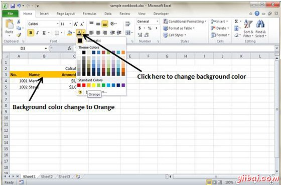
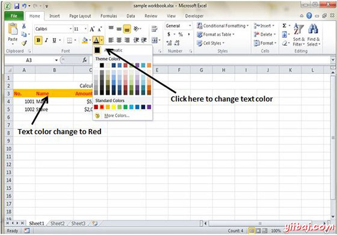
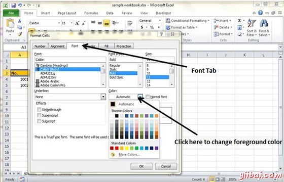

# Excel设置颜色 - Excel教程

可以更改单元格或文本颜色的背景颜色。

## 更改背景颜色

在MS Excel默认的单元格的背景颜色是白色。你可以把它按需要更改 **首页标签»字体组»背景颜色**

## 更改前景色

在MS Excel中，默认情况下，前景或文本颜色为黑色。你可以把它按您的需要更改** 首页标签»字体组»前景色**

也可以通过选择单元格更改前景色 右键单击»设置单元格格式»字体选项卡»颜色

