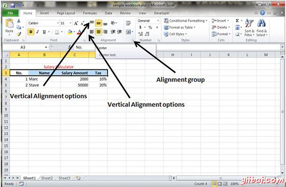
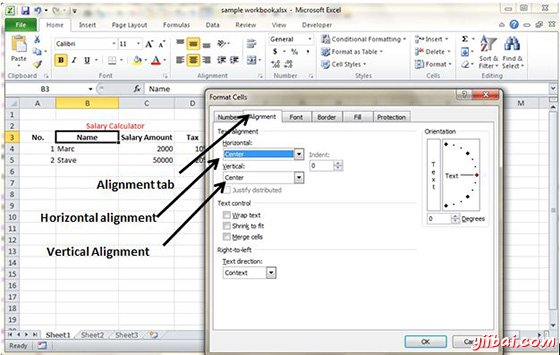

# Excel文字对齐方式 - Excel教程

如果你不喜欢单元格的默认对齐方式，您可以更改单元格对齐方式。下面是更改单元格对齐方式的各种方法。

## 从主页选项卡中更改对齐方式

你可以更改单元格的水平和垂直对齐。默认Excel对齐数字向右，文本则是左边对齐。点击对齐方式组中的可用选项选项卡以更改对齐。

## 从设置单元格格式更改对齐方式

右键单击单元格，然后选择格式的单元格。在单元格格式对话框中选择对齐选项卡。选择从垂直对齐和水平对齐选项可用选项

## 浏览对齐选项

**1. 水平对齐：**可以设置水平对齐方式为左，中心，右等

*   **左：**对齐单元格内容到单元的左侧。

*   **中心：**居中单元格内容。

*   **右：**校准单元格内容向右侧的单元格。

*   **填充：**重复单元的内容，直到该单元格的宽度被充满。

*   **两端对齐：**对齐文本到小区的左边和右边对齐。此选项仅适用如果单元格的格式设置为文本包裹，并使用多行。

**2.垂直对齐方式：**您可以设置垂直对齐到顶部，中部，底部等等。

*   **居顶部：**校准单元格内容到单元的顶部。

*   **居中：**居中的单元格内容垂直在单元格。

*   **居底部：**校准单元格内容到单元的底部。

*   **两端对齐：**两端对齐竖直单元格中的文本; 此选项仅适用如果单元格的格式设置为文本包裹，并使用多行。

