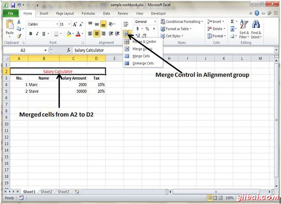
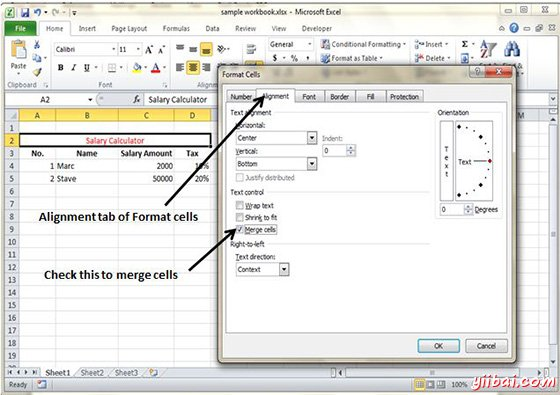
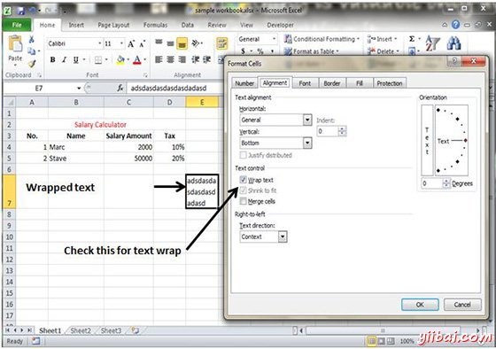

# Excel合并及换行 - Excel教程

## 合并单元格

MS Excel中，您可以合并两个或多个单元格。当你合并单元格，您不要在单元格的内容。相反，结合一组单元格向占据同一空间中的单个单元格。

您可以通过如下多种方式合并单元格

*   选择合并与中心控制功能区上更简单。要合并单元格，选择想要合并的然后单击合并及居中按钮合并单元格。

*   选择单元格格式对话框合并单元格对齐选项卡

## 其他选项

主页»对齐方式组»合并与控制中心包含一个下拉列表，这些额外的选项：

*   合并多个：当选择多行范围，该命令将创建多个合并单元格 - 每个行。

*   合并单元格：合并选定单元，而不应用中心属性。

*   取消合并单元格：取消合并选定的单元格。

## 换行和缩小以适合

如果您有文字太宽适合列宽，但不希望该文本延到相邻的单元格， 您可以使用环绕文本选项或收缩以适应选项，以适应该文本。

