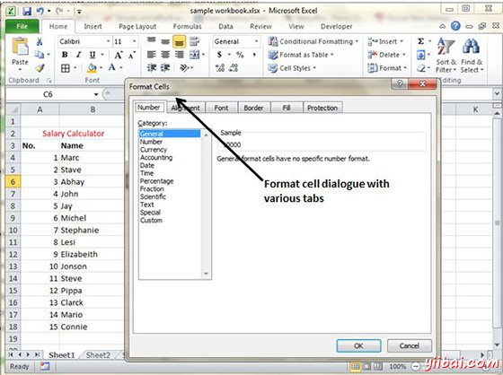

# Excel应用格式化 - Excel教程

## 格式化单元格

在MS Excel中，你可以应用格式单元格的单元格或范围内右键点击»设置单元格格式»选择标签。有各种标签可用如下

## 替代放置背景

*   数值：可以设置单元格的格式取决于单元格内容。查找教程在[MS Excel - 设置单元类型](http://www.yiibai.com/excel/excel_setting_cell_type.html)

*   对齐方式：可以在此选项卡中设置文本的对齐方式。查看教程在[MS Excel文本对齐方式](http://www.yiibai.com/excel/excel_text_alignments.html)

*   字体：可以设置此选项卡上的文字字体。查看教程在[MS Excel设置字体](http://www.yiibai.com/excel/excel_setting_fonts.html)

*   边框：可以设置单元格边框与此标签。查看教程在[MS Excel边框和色调](http://www.yiibai.com/excel/excel_borders_and_shades.html)

*   填充：可以使用此选项卡中设置单元格填充。查看教程在[MS Excel边框和色调](http://www.yiibai.com/excel/excel_borders_and_shades.html)

*   保护：可以设置该选项卡中单元格保护选项。

