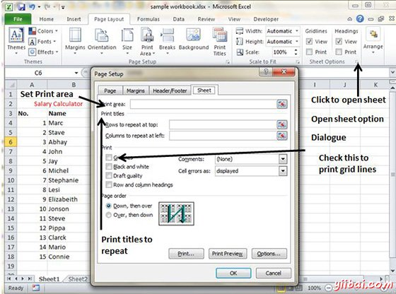

# Excel表选项 - Excel教程

## Excel表选项

MS Excel提供了各种工作表用于打印用途等通常单元格的选择。如果你想打印输出，包括网格线，选择页面布局»表选项组»网格线»检查打印

## 在表选项对话框选项

*   **打印区域：**可以设置打印区域使用此选项。

*   **打印标题：**您可以设置标题出现在为行的顶部和左侧的列。

*   **打印：**

    *   **网格线：**以网格线打印时出现在工作表。

    *   **黑与白：**选中此复选框将彩色打印机打印图表黑色和白色。

    *   **草稿：**选中此复选框以打印使用打印机的草稿质量设置图表。

    *   **行和列标题：**选中此复选框有行和列标题打印。

*   **页面顺序：**

    *   **向下，然后经过：**它打印下来的网页，然后再右页。

    *   **经过，再向下：**它打印右页，然后再来找打印下来的网页。

