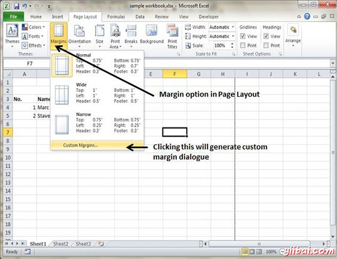
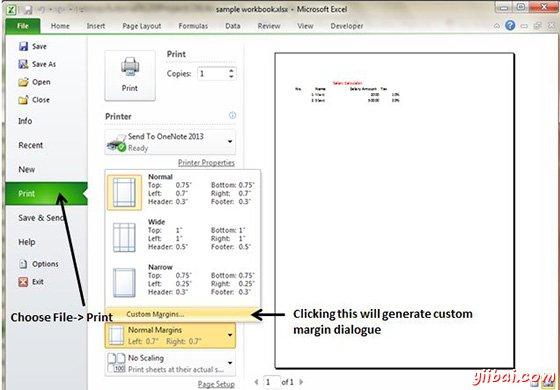
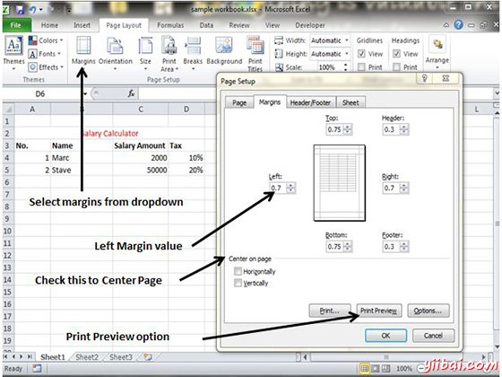

# Excel调整边距 - Excel教程

## 边距

边距是沿着侧面，顶部，和一个打印页的底部的未打印区域。在MS Excel的所有打印页面上有相同的边距。您不能指定不同的边距在不同的页面。

您可以通过多种方式设置页边距，如下

*   选择页面布局»页面设置»边距下拉列表中，您可以选择普通，宽，窄，或自定义设置。

*   这些选项也可当你选择文件»打印。

如果没有这些设置做这项工作，选择自定义边距以显示页面设置对话框中的边距选项卡，如下图所示。

## 在页面中心

默认情况下，Excel中对齐顶部和左侧边距打印的页面。 如果你想输出进行垂直或水平居中，选择在中心相应的复选框上边距选项卡页部分，如图上面的截图。

