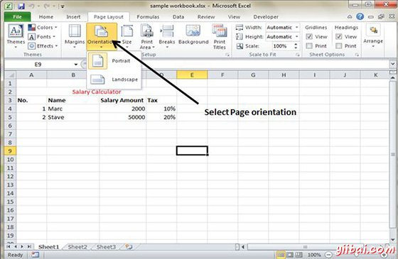
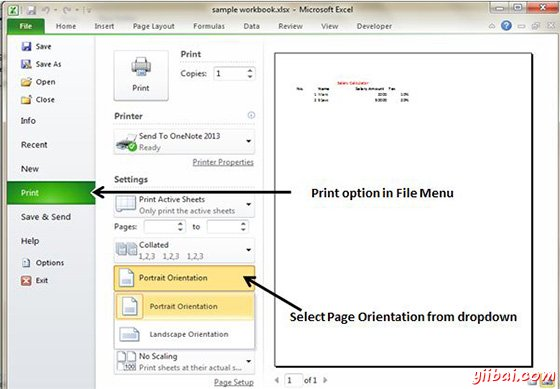

# Excel页面方向 - Excel教程

## 页面方向

页面方向是指如何输出被打印在页面上。如果你改变了方向，屏幕上的分页符自动调整以适应新的纸张方向。

## 页面方向类型

*   **纵向：**纵向打印页面高度(默认值)。

*   **横向：**横向打印宽网页。当你有一个广泛的不适合垂直方向的页面上横向是非常有用的。

## 更改页面方向

*   选择页面布局»页面设置»»方向纵向或横向

*   选择文件»打印

