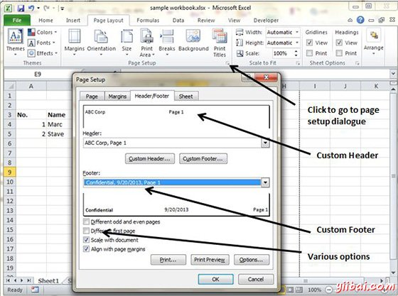

# Excel页眉和页脚 - Excel教程

## 页眉和页脚

页眉是出现在每个打印页的顶部信息和页脚是出现在每个打印页面的底部信息。 默认情况下，新的工作簿没有页眉或页脚。

## 添加页眉和页脚

*   选择页面设置对话框»页眉或页脚选项卡

你可以选择预定义的页眉和页脚，或创建自定义

*   **&[Page] : **显示页面码

*   **&[Pages] :** 显示要打印的总页数

*   **&[Date] : **显示当前的日期

*   **&[Time] : **显示当前时间

*   **&[Path]&[File] :** 显示工作簿的完整路径和文件名

*   **&[File] : **显示工作簿的名称

*   **&[Tab] : **显示表的名字

## 其它页眉和页脚选项

当一个页眉或页脚在页面布局视图中选择，页眉和页脚»设计»选项组包含让您指定的其他选项控制：

*   **不同的第一页：**选中该指定不同的页眉或页脚为第一打印页上。

*   **不同奇数和偶数页：**选中该指定不同的页眉或页脚奇数页和偶数页。

*   **缩放文件：**如果选中，在页眉和页脚的字体大小会大。因此，如果打印文档时缩放。启用此选项，默认情况下。

*   **与页边距对齐：**如果选中，左侧页眉和页脚将与左边缘对齐，右页眉和页脚将与右页边距对齐。启用此选项，默认情况下。

