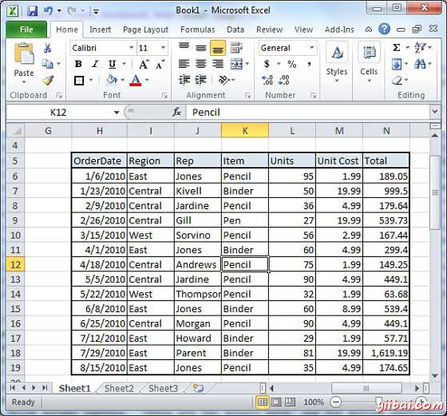
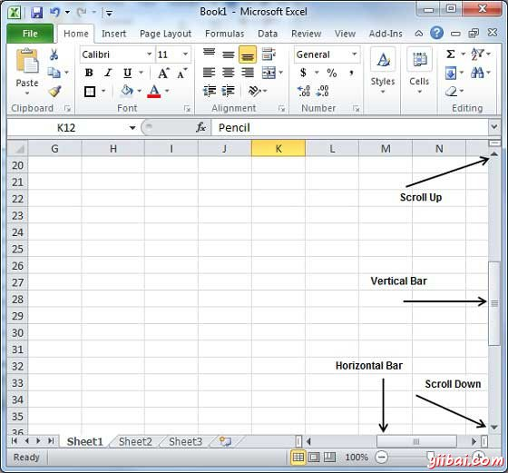
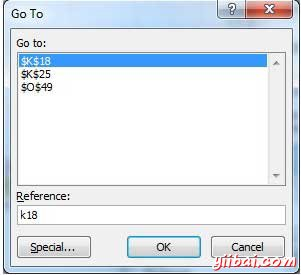

# Excel左右移动 - Excel教程

Excel提供多种方式移动，使用鼠标和键盘在工作表。

我们继续之前，首先让我们来创建一些示例文本。 打开一个新的Excel表，然后键入数据。我们已经截图所示的样本数据。

| OrderDate | Region | Rep | Item | Units | Unit Cost | Total |
| --- | --- | --- | --- | --- | --- | --- |
| 1/6/2010 | East | Jones | Pencil | 95 | 1.99 | 189.05 |
| 1/23/2010 | Central | Kivell | Binder | 50 | 19.99 | 999.5 |
| 2/9/2010 | Central | Jardine | Pencil | 36 | 4.99 | 179.64 |
| 2/26/2010 | Central | Gill | Pen | 27 | 19.99 | 539.73 |
| 3/15/2010 | West | Sorvino | Pencil | 56 | 2.99 | 167.44 |
| 4/1/2010 | East | Jones | Binder | 60 | 4.99 | 299.4 |
| 4/18/2010 | Central | Andrews | Pencil | 75 | 1.99 | 149.25 |
| 5/5/2010 | Central | Jardine | Pencil | 90 | 4.99 | 449.1 |
| 5/22/2010 | West | Thompson | Pencil | 32 | 1.99 | 63.68 |
| 6/8/2010 | East | Jones | Binder | 60 | 8.99 | 539.4 |
| 6/25/2010 | Central | Morgan | Pencil | 90 | 4.99 | 449.1 |
| 7/12/2010 | East | Howard | Binder | 29 | 1.99 | 57.71 |
| 7/29/2010 | East | Parent | Binder | 81 | 19.99 | 1,619.19 |
| 8/15/2010 | East | Jones | Pencil | 35 | 4.99 | 174.65 |

## 使用鼠标移动

您可以通过点击任何地方的文字在屏幕上轻松地移动到插入点。有时候，如果表是很大，那么看不到你要移动的地方。在这种情况下，将不得不使用滚动条，如下面的屏幕截图：

可以通过滚动鼠标滚轮，这相当于点击滚动条的向上箭头或向下箭头按钮来滚动工作表。

## 使用移动滚动条

如图上面的屏幕捕获，有两个滚动条：一个用于片内垂直移动，和一个用于水平移动。使用垂直滚动条，您可以：

*   通过点击朝上的滚动箭头向上移动一行。

*   通过点击朝下的滚动箭头向下移动一行。

*   移动一个翻页，使用翻页键（脚注）。

*   移动一前一页面，使用前一页按钮（脚注）。

*   使用浏览对象（Browse Objec）按钮移动通过工作表，从一个选择的对象到下一个。

## 使用键盘移动

下面的键盘命令，用于您的工作表四处移动，也可移动到插入点：

| Keystroke | 其中，将移到到插入点 |
| --- | --- |
|  | 向前移动一个框 |
|  | 倒退一个框 |
|  | 向上移动到一个框中 |
|  | 向下移动到一个框中 |
| PageUp | 到上一个屏幕 |
| PageDown | 到下一个屏幕 |
| Home | 到当前屏幕的开始 |
| End | 到当前屏幕的结束 |

您可以移动框内或逐页。现在点击包含在工作表的任何框数据。需要按住Ctrl键的同时按箭头键，这将插入点移动，如下所述：

| 组合键 | 其中，将移到到插入点 |
| --- | --- |
| Ctrl +  | 包含当前行的数据到最后一个框中 |
| Ctrl +  | 包含当前行的数据到第一框中 |
| Ctrl +  | 包含当前列的数据到第一框中 |
| Ctrl +  | 包含当前列的数据到最后一个框中 |
| Ctrl + PageUp | 在当前工作表到左边的工作表。 |
| Ctrl + PageDown | 在当前工作表到右边的工作表。 |
| Ctrl + Home | 到工作表的开始 |
| Ctrl + End | 到工作表的结束 |

## 使用定位命令移动

按F5键使用转到（Go To）命令，它会显示一个对话框，在这里将有多种选择来达到特定的盒子。

通常我们使用的行和列数，例如K5 ，按GO按钮。

