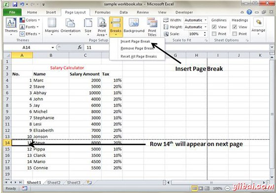
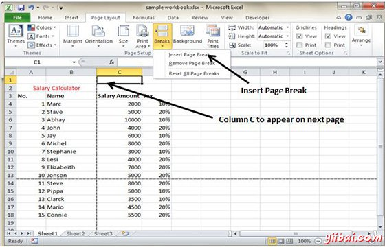

# Excel插入分页符 - Excel教程

## 分页符

如果你不想行打印页本身或者你不想表格标题行是一个页面上的最后一行。 MS Excel为您提供了精确的控制分页符。

MS Excel会自动处理分页，但有时可能需要强制分页符垂直或水平，所以，此报告打印你想要的方式。

例如，如果工作由几个不同的部分，可能想在另一张纸上打印每个部分。

## 插入分页符

插入水平分页符：例如，如果想要行14是一个新的页面，第一行选择单元格A14。然后选择页面布局»页面设置组»分页符»插入分页符。

插入垂直分页符在这种情况下，要确保将指针放在第1行。选择页面布局»页面设置»符»插入分页符创建分页符。

## 删除分页符

*   删除添加了的一个分页符：将单元格指针到第一行下方的手动分页符，然后选择页面布局»页面设置»符»删除分页符。

*   删除所有手动分页符：选择页面布局»页面设置»分页符»重置所有分页符。

