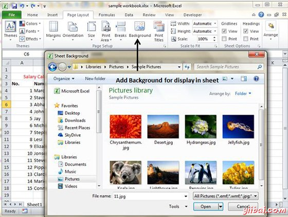

# Excel设置背景 - Excel教程

## 背景图片

如果想你的打印输出的背景图像，然后不幸的是，不能。 可能已经注意到了页面布局»页面设置»背景命令。此按钮将显示一个对话框，让你选择一个图像显示为背景。放置这种控制在其他打印相关的命令是很大的误导。放置在一个工作表背景图片永远不会打印。

## 替代放置背景

*   您可以将图形，艺术字，或者你的工作表上的照片，然后调整其透明度。然后将图像复制到所有打印页面。

*   可以插入页眉或页脚的对象。

