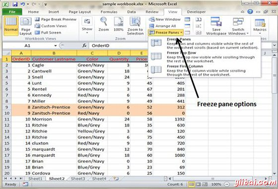
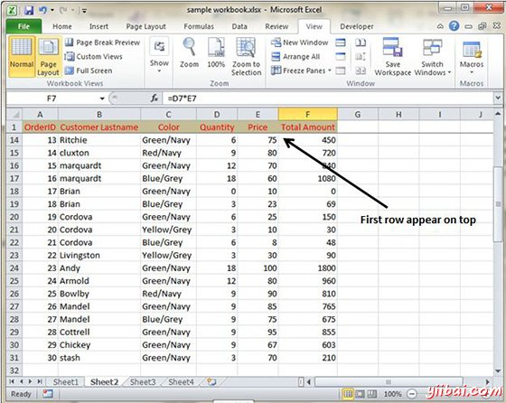

# Excel冻结窗格 - Excel教程

## 冻结窗格

如果你设置了行或列标题在工作表中，当向下滚动或向右这些标题将不可见。MS Excel提供了一个方便的解决这个问题，冻结窗格。冻结窗格保持标题可见，在滚动工作表时。

## 使用冻结窗格

请按照以下步骤做冻结窗格

*   选择第一行或第一列或行下面是要冻结或列右到要冻结区域

*   选择查看标签»冻结窗格

*   选择合适的选项

    *   冻结窗格：要冻结单元区域

    *   冻顶行：冻结工作表的第一行

    *   冻结第一列：冻结工作表的第一列

*   如果您选择冻结顶行，可以看到第一行还滚动后出现在顶部。请参阅下面的屏幕截图

## 取消冻结窗格

解冻窗格中选择查看标签»取消冻结窗格

