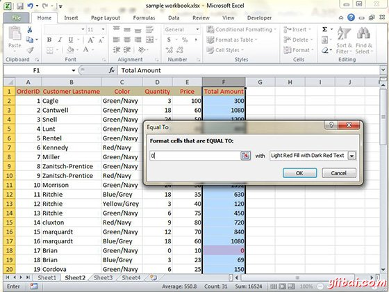
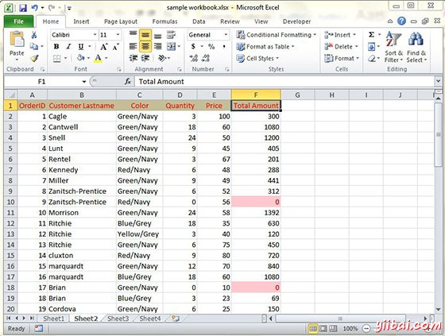
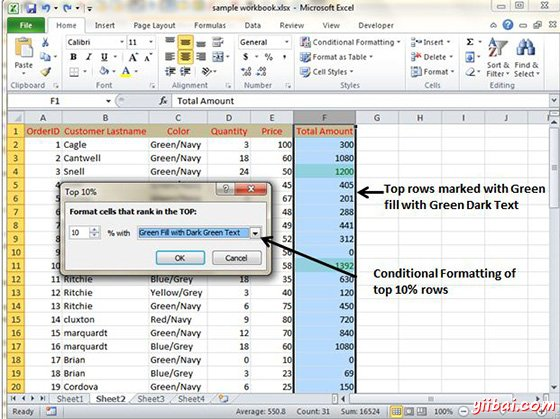
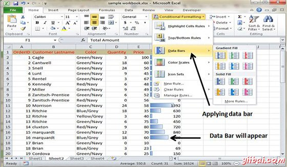
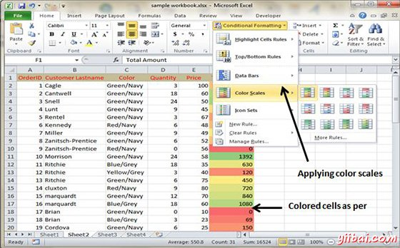
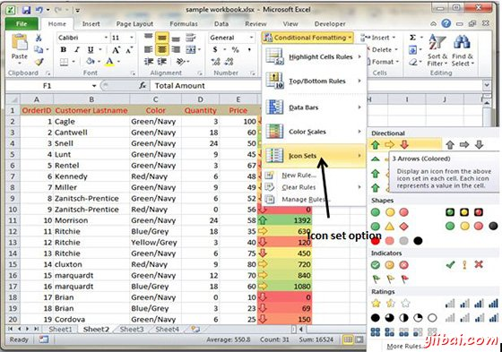

# Excel条件格式 - Excel教程

## 条件格式

MS Excel 2010的条件格式功能，可以格式化值的范围，使外部一定的限度值，会自动格式化。

选择主页选项卡»样式组»条件格式下拉列表。

## 各种条件格式选项

*   高亮单元格规则：它带有多种选项的延续菜单用于定义高亮显示单元在包含某些值，文本或日期，或具有值的比的特定值更大或更小，或选择格式化规则值的一定范围内。

假设你想找到具有单元格数量0，并标记它们为红色。选择的单元格»主页选项卡»条件格式下拉范围»高亮度小区规则»等于

单击确定单元格具有零值后，被标记为红色。

*   **顶部/底部规则：**它带有多种选项来定义，突出的顶部和底部值，百分比及上面和下面的平均值在小区选择格式化规则的延续菜单。

假设想强调前10%的行，你可以做到这一点与这些顶部/底部规则

*   **数据栏：**它会打开可以应用到小区选择相对于彼此通过单击数据栏缩略图来表示它们的值在不同颜色的数据栏的调色板。

有了这个条件格式数据栏会出现在每个单元中。

*   **色标：**它打开不同的三和二色鳞片的调色板，可以应用到单元格选择相对于彼此通过点击色标缩略图来表示它们的值。

请参见下面的截图具有色标应用条件格式。

*   **图标设置：**它会打开不同组的图标，你可以应用到单元格选择相对于彼此通过点击图标设置为显示其值的调色板。

请参见下面的截图具有图标设置应用于条件格式。

*   **新规则：**它打开了新的格式规则对话框，在其中定义自定义条件格式规则应用到单元格选择。

*   **明确的规则：**它打开一个延续菜单，在这里你可以通过点击选中的单元格选项单击整个工作表选项，通过点击该表中删除条件格式规则为单元格选择，对于整个工作表，或仅仅是当前数据表选项。

*   **管理规则：**它打开条件格式规则管理器对话框，在其中您可以编辑和删除特定的规则，以及通过上移或规则列表框中向下调整自己的规则优先级。
