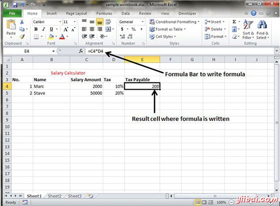

# Excel创建公式 - Excel教程

## MS Excel公式

公式是工作表的面包和黄油。如果没有公式工作表将数据只是简单的表格表示。公式由被输入到单元格特殊代码。它执行一些计算，并返回一个结果，并显示在单元格中。

公式使用各种运算符和工作表函数具有值和文本工作。公式中使用的值和文本可以位于其他单元格，这使改变数据容易并给出工作表的动态本质。例如，您可以快速改变工作表和公式工作数据。

## 公式的要素

公式可以包含这些元素：

例如：

*   数学运算符，如+(加法)和*(乘法)

    *   =A1+A2 相加单元格A1和A2的值。

*   值或文本

    *   =200*0.5 200乘以0.5倍。这个公式只使用值，它总是返回相同的结果为100。

*   单元格引用(包括命名的单元格和范围)

    *   =A1=C12 比较单元格A1与单元格C12。如果值是相同的，该公式返回TRUE;否则，返回FALSE。

*   工作表函数(如SUMor平均值)

    *   =SUM(A1:A12) 在添加范围的值在A1：A12。

## 创建公式

要创建公式，你需要输入公式栏。公式以“=”号开始。当手动构建公式，您可以键入单元格地址，也可以指向他们在工作表中。使用定点方法提供了单元格地址的公式构建往往更容易，更有效的方法。如果您使用的是内置的功能，通过点击的单元格范围定义函数的参数的函数参数对话框，当您想要使用的单元或拖动。请参阅下面的屏幕截图。

当完成一个公式项，Excel计算的结果，然后将其在工作表内的单元格内显示(公式中的内容，但是，仍然是对公式栏随时单元格是活性可见)。如果你把一个错误，阻止Excel能够计算公式在所有的公式中，Excel会显示一个警告对话框，提示如何来解决这个问题。

