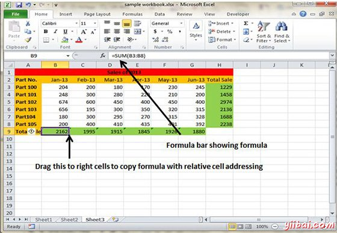
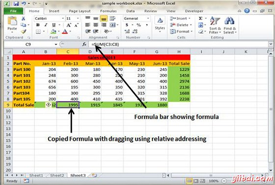

# Excel复制公式 - Excel教程

## 在MS Excel中复制公式

复制公式是你在一个典型的电子表格主要依靠公式执行的最常见的任务之一。当公式使用单元格引用而不是常数值，Excel可以复印原稿公式每一个需要类似的公式地方的任务。

## 相对单元格地址

MS Excel中它会自动调整，在原来的公式的单元格引用，以适应副本的位置。 它通过称为相对单元格地址的系统，凡在公式更改单元格地址的列引用，以适应新的列位置和行引用改变，以适应他们的新行的位置。

让我们来看看这个例子与帮助。即公式，假设我们希望在最后所有的行总和那么我们会写第一列，我们所需的行的总和为3至8的第9行中。

写公式在第九列后，我们就可以将其拖动到其余列和公式被复制。拖动后我们可以看到公式中的其余列如下。

*   column C : =SUM(C3:C8)

*   column D : =SUM(D3:D8)

*   column E : =SUM(E3:E8)

*   column F : =SUM(F3:F8)

*   column G : =SUM(G3:G8)

