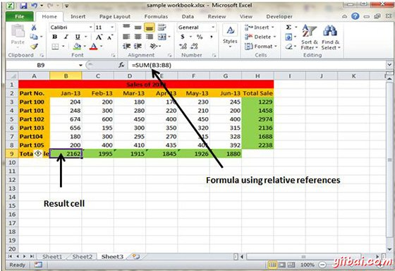
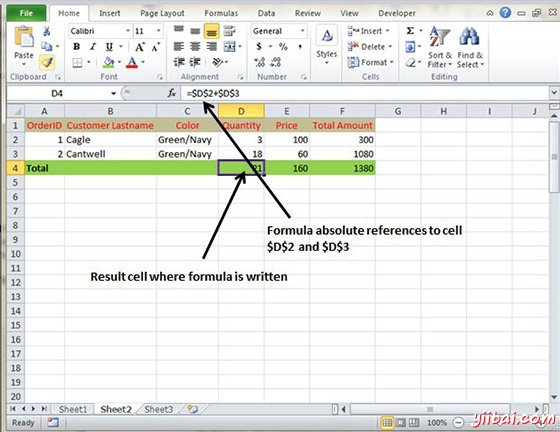
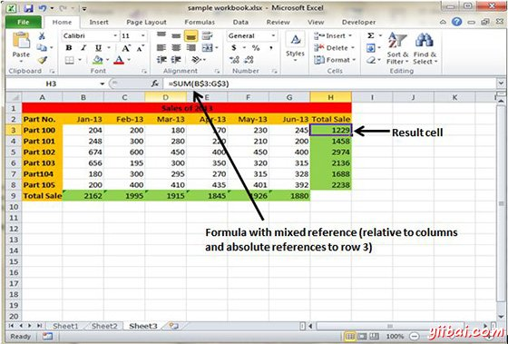

# Excel公式参考 - Excel教程

## 单元格公式引用

创建大多数公式包含对单元格或范围。这些引用使您的公式包含在这些单元格或范围的数据动态地工作。例如，如果你的公式引用单元格C2和更改包含在C2的值，公式结果反映了新的值，并且自动未在公式中使用引用，就需要以改变公式中使用的值来编辑公式本身。

当您使用公式的单元格（或区域）的参考，你可以使用三种类型的引用：相对的，绝对的，和混合引用

## 相对单元格引用

当将公式复制到另一个单元格，因为引用实际上从当前行和列偏移的行和列的引用可以改变。默认情况下，Excel创建公式相对单元格引用。

## 绝对单元格引用

当您复制公式，因为引用的是一个实际的单元格地址的行和列引用不会改变。绝对参考使用其地址的两个美元符号：一个用于列字母，一个用于行数（例如， $A$5）。

## 混合单元格引用

无论是行或列的参考都是相对的，而另一个是绝对的。 只有地址部分的一个是绝对的（例如，$A5或A$5）

