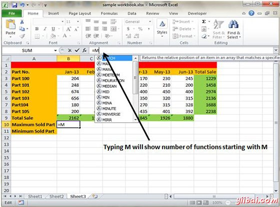
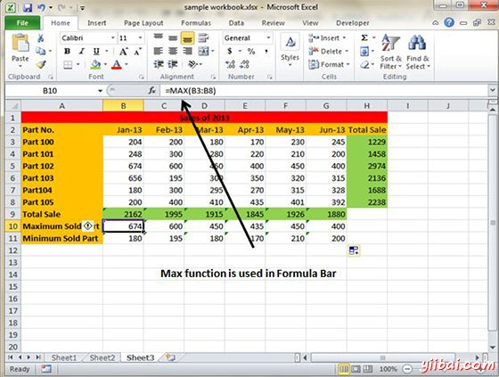

# Excel使用函数 - Excel教程

## 在公式中的函数

许多公式创建利用现有工作表函数。这些函数使您可以大大提升公式的能力和执行计算，如果使用运符有困难。例如，您可以使用日志或正弦函数来计算对数或Sin比例。 通过单独使用数学运算符，不能做复杂的计算。

## 使用函数

当键入等号(=)，然后键入任何字母，你会看到如下的搜索功能。

假设需要确定的范围内的最大值。公式不能告诉你不使用函数回答。 我们将用采用MAX函数式返回范围的最大值 B3:B8 as =MAX(A1:D100)

函数的另一个例子。假设你要找到，如果一个月的单元大于1900，那么我们可以给销售代表奖金。在我们可以编写公式IF函数为实现这一目标 =IF(B9&gt;1900,"Yes","No")

## 函数的参数

在上面的例子中，你可能已经注意到，所有的函数中使用括号。括号内的信息参数列表。

函数变化，它们如何使用不同的参数。根据它做什么，函数可以使用。

*   **没有参数 : **例子: Now(),Date(),etc

*   **一个参数:** UPPER(),LOWER(),etc

*   **参数固定数量 :** IF(),MAX(),MIN(),AVERGAGE(),etc.

*   **无限数目的参数：**

*   **可选参数：**

