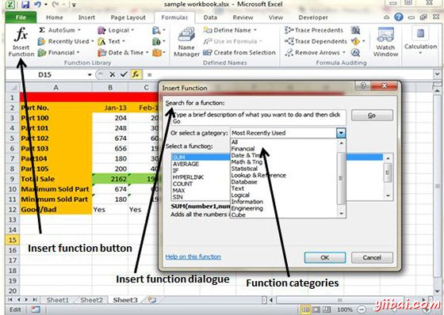

# Excel内置函数 - Excel教程

## 内置函数

MS Excel中有许多内置的函数，我们可以在公式中使用。若要查看类别中的所有函数，选择公式选项卡»插入函数。然后插入函数对话框出现，从中我们可以选择的函数。

## 函数类别

让我们来看看一些在建在MS Excel的函数。

*   文本函数

    *   UPPER : 所有字符转换成在提供的文本字符串为小写

    *   UPPER : 所有字符转换成在提供的文本字符串为大写

    *   TRIM : 删除重复的空间，并在一个文本串的开始和结束的位

    *   CONCATENATE : 连接在一起的两个或多个文本字符串

    *   LEFT : 返回指定的字符数，从所提供的文本字符串的开始

    *   MID : 返回指定的字符数从提供的文本字符串的中间

    *   RIGHT : 返回指定的字符数从提供的文本字符串的结尾

    *   LEN : 返回一个提供的文本字符串的长度。

    *   FIND : 返回从提供的文本字符串中的字符提供或文本字符串的位置(区分大小写)

*   Date & Time

    *   DATE : 返回日期，从用户提供的年，月和日

    *   TIME : 返回一个时间，从用户提供的时，分，秒

    *   DATEVALUE : 表示日期，表示在Excel的日期 - 时间码的时间的文本字符串，转换为整数

    *   TIMEVALUE : 表示一个时间，它表示在Excel中时间的文本字符串，十进制转换

    *   NOW : 返回当前的日期和时间

    *   TODAY : 返回当今的日期

*   Statistical

    *   MAX : 从提供的数据列表中返回最大值

    *   MIN : 从提供的数值列表中返回最小值

    *   AVERAGE : 返回提供的数值列表的平均

    *   COUNT: 返回在供给组单元格或值的数值的个数

    *   COUNTIF : 返回单元的数目(一个供给范围)，满足给定的标准

    *   SUM : 返回供给的数字列表的总和

*   Logical

    *   AND : 测试了一些用户定义的条件，如果所有的条件计算为TRUE返回TRUE，否则返回FALSE。

    *   OR : 测试了一些用户定义的条件，如果任何条件计算为TRUE返回TRUE，否则返回FALSE。

    *   NOT : 返回一个逻辑值，为用户的提供相反的逻辑值或表达式，即返回FALSE是提供的参数为TRUE，如果提供的参数为FALSE返回TRUE)

*   Math & Trig

    *   ABS : 返回所提供的数字的绝对值(即模量)

    *   SIGN : 返回一个供给数的符号sign(+ 1，-1或0)

    *   SQRT : 返回一个给定数的正平方根

    *   MOD : 返回两个提供的数字之间从一个除法的余数

