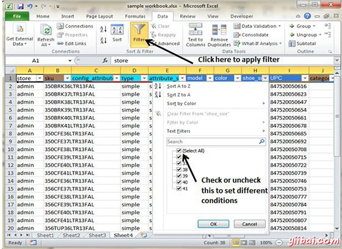
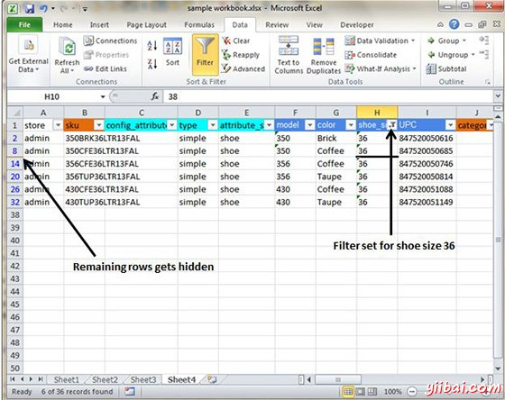
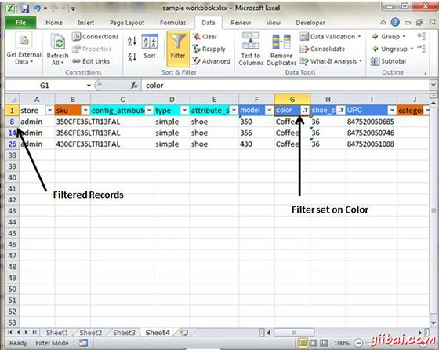

# Excel数据过滤 - Excel教程

## 在MS Excel的过滤器

在MS Excel的数据筛选是指只显示符合某些条件的行(其他行被隐藏。)

使用存储数据，如果有兴趣希望看到其中鞋码为36的数据。然后，您可以设置过滤器来做到这一点。请按照以下步骤来做到这一点

*   将光标置于标题行

*   选择数据选项卡»过滤器，设置过滤器

*   单击区域行标题的下拉箭头，并删除全部选中的对勾取消选择。

*   然后选中关口尺寸36，将过滤鞋码36的数据并显示数据

*   一些行的数据丢失; 这些行包含过滤(隐藏)数据。

*   有在该地区列下拉箭头，现在显示不同的图形 - 一个图标，指示列过滤

## 使用多个过滤器

可以通过即通过多列值的多个条件筛选记录。假设大小是36在过滤后，需要有过滤器，其中颜色是等于咖啡色。设置过滤器鞋码后，选择颜色列，然后设置过滤器颜色

