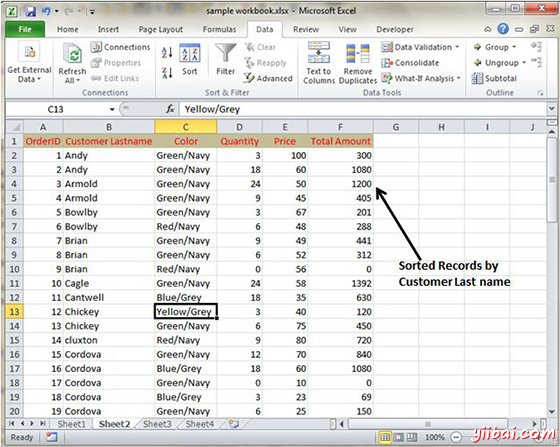

# Excel数据排序 - Excel教程

## 在MS Excel排序

在MS Excel数据重新排列基于特定列的内容的行上。可能要排序表把名字的字母顺序。或者，也许想通过数据量从最小到最大或最大到最小排序。

排序的数据按照以下步骤。

*   通过选择想要的数据排序的列。

*   选择数据选项卡»排序，出现以下对话框

*   如果你想进行排序的基础上选定的列数据选择继续使用选择，或如果想基于其他列排序选择展开选择。

*   您可以排序基于以下条件。

    *   值：字母或数字

    *   单元格颜色：基于单元的颜色

    *   字体颜色：根据字体颜色

    *   单元格图标：基于单元格图标

*   单击确定将数据进行排序。

排序选项也可以从主页选项卡。选择主页选项卡»排序和筛选。可以看到相同的对话框排序记录。

