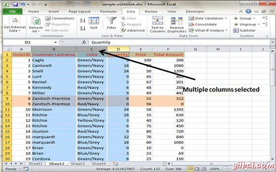

# Excel使用范围 - Excel教程

## 使用范围

单元是在工作表中，可容纳一个值，一些文字或公式的单个元素。一个单元是由它们的地址，其中包括其列字母和行号的。例如，单元格B1是在第二列和第一行的单元格。

一组单元被称为一个范围。指定的地址范围内通过指定的左上角单元格地址和右下角单元格地址，用冒号分隔

范围的例子

*   **C24 :** 由单个单元的范围

*   **A1:B1 :** 两个单元格占据一行和两列

*   **A1:A100 :** 100个单元在A列

*   **A1:D4 :** 16单元格(四行四列)

## 选择范围

可以选择的范围在几个方面：

*   按下鼠标左键并拖动，突出范围。 然后松开鼠标按钮。如果拖动到屏幕的结束，工作表将滚动。

*   按住Shift键的同时使用导航键选择一个范围。

*   按F8键，然后移动单元格指针与导航键突出显示范围。按F8再次向导航键恢复正常运行。

*   键入单元格或单元格区域的地址到名称框，然后按Enter键。 Excel中选择您指定的单元格或区域。

## 选择完整的行和列

当你需要选择一个整行或列。可以选择为选择范围整个行和列在大致相同的方式：

*   单击行或列边界，以选择单个行或列。

*   要选择多个相邻的行或列，单击行或列边框并拖动突出额外的行或列。

*   要选择多个（不相邻的）行或列，按Ctrl键的同时单击所需的行或列边框。

