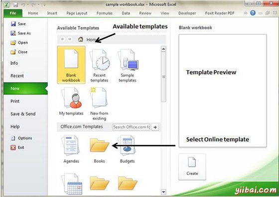

# Excel使用模板 - Excel教程

## 在MS Excel中使用模板

模板本质上是一个模型，模型作为基础的东西。Excel模板是我们用来创建其他工作簿的工作簿。

## 查看可用模板

要查看Excel的模板，选择文件»新建以显示Backstage视图可用模板画面。您可以选择存储在硬盘上的模板，或者从Microsoft Office Online模板。如果您选择从Microsoft Office Online模板，必须连接到Internet下载。Office 在线模板部分包含许多图标，其中表示各种类别的模板。点击一个图标，你会看到可用的模板。当您选择一个模板缩略图，可以看到在右侧面板中的预览。

## 在线模板

这些模板数据是Microsoft服务器在线提供的。当您选择模板，点击它。它会下载从微软服务器的模板数据和打开它，如下所示。

