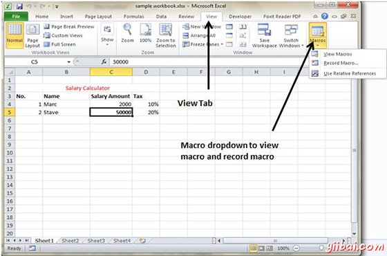
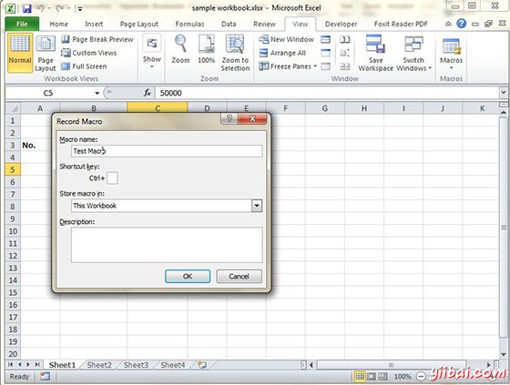
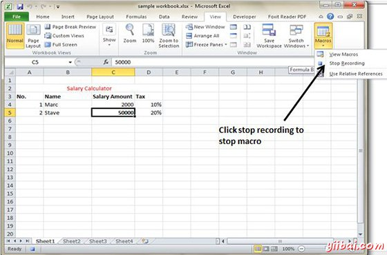
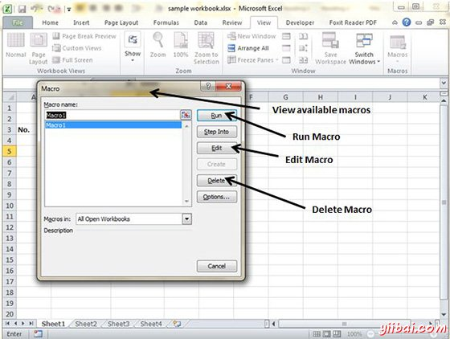

# Excel使用宏 - Excel教程

## MS Excel宏

宏使您能够自动化，可以在Excel 2010中几乎承担所有的任务。通过使用视图选项卡的宏录制»宏，下拉来记录执行例行任务，不仅大大加快了程序，在任务的每一步是每一位执行任务的时候进行了同样的方式。

要查看宏选择查看标签»宏下拉

## 宏选项

查看选项卡包含一个宏命令按钮其中下拉菜单包含以下三个选项。

*   查看宏：打开宏对话框，您可以选择一个宏运行或编辑。

*   录制宏：打开，新的宏定义设置，然后启动宏录制录制宏对话框; 点击状态栏上的录制宏按钮。

*   使用相对引用：录制宏时使用相对单元格地址，使您能够在工作表比原来用在宏的录制以外的其它地区运行的宏。

## 创建宏

可以使用两种方式创建宏：

*   使用MS Excel的宏记录器来记录动作，在工作表进行

*   输入要遵循VBA代码，Visual Basic编辑器的说明

现在，让我们创建一个简单的简单的宏，将自动使单元格内容为粗体的任务和应用单元格颜色。

*   选择查看标签»宏下拉

*   点击录制宏如下

*   现在，宏将开始录制。

*   做动作要重复执行的步骤。宏会记录这些步骤。

*   一旦与所有步骤完成宏录制，可以停止。

## 编辑宏

可以随时编辑创建宏。编辑宏将带你到VBA编程编辑器

